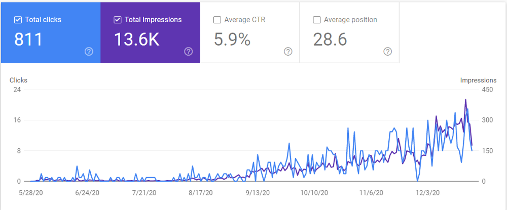
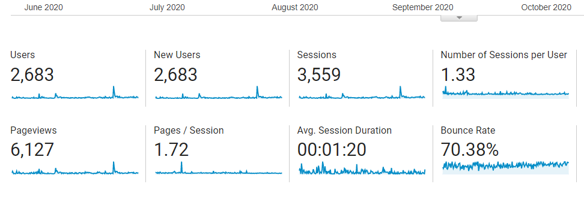

OMO!! (If you're non-Nigerian, this is where you scream OMG!!!) This year was certainly one hell of a year. 

From the coronavirus pandemic, the #BlackLivesMatter campaign, the Nigerian #EndSars protests, Trump refusing to concede defeat in the US presidential elections, Kim Jung-un faking his death, to Paystack getting acquired by Stripe for an amount rumoured to be well over $200 million, this year gave it all. It gave us some of the worst moments ever, accompanied with some of the best, forced us to be imprisoned in our houses, but it also tried to teach us what really matters  - for those who were willing to observe.

This is going to be my first ever end-of-the-year review, and I'm going to commit to doing it every year to serve as a tool to track my own progress for days when I start to feel like an impostor or days when I feel like I have nothing to be grateful for.

## Work

I officially started my tech career this year after lackadaisically romanticising cloud and frontend development while still in school. I wrote my final undergraduate exams sometime in December 2019 and was wondering what I was going to do with my life when a call came through. This call had me fly into Lagos and live in a hotel room in Victoria island for the first two months of the year courtesy of Huawei. After this period, I got an opportunity to work with Huawei as a Cloud Solutions intern with the EBG team. This meant I had to move to Lagos permanently. 

Moving to Lagos was hard. It was difficult for me. I had to go stay with my aunt who lived on the mainland while my office was on the island. This meant that I had to wake up early each day and be at the bus stop by 5:30am so the office bus could take me to work and bring me back around 8:45pm, after enduring over 5 hours in traffic each day. 

It was a really difficult adjustment to make and I was just on the verge of burnout when the pandemic hit and we were all asked to work from home. Not to be selfish, but this had to be like the best thing that happened to me this year. I couldn't be happier. No more commuting, no more crazy Lagos traffic. I had more time to improve my skills, devoted time to learning React, built my personal website, started blogging, and worked on my first 2 freelance projects. To close off the year, I joined Omnibiz as a React JS Frontend developer.

## Writing

The highlights of my writing journey: I made over a million naira from guest writing in 4 months, my articles got featured on the Freecodecamp and Forloop newsletters, and I got to write for CSS tricks - Yes, the CSS Tricks you know, the one that all frontend developers read!! (screaming internally right now). 

I decided to start writing technical articles around May as a means to share my knowledge, solidify my knowledge and build a reputation for myself. In total, I wrote 21 articles, 9 of which were paid. I also monetized my blog with Coil sometime around August and made approximately $5 (fuunnds yeah ?).

Amongst all those articles, one of the most popular was The Self Taught Developer's guide to learning how to code which I wrote on Freecodecamp. This single article has been shared by Freecodecamp every month on their Twitter account since its date of publication, has earned me over 400 new Twitter followers and has been read by over 10,000 people. Some of my other popular articles are:

- <a target="blank" class="inline-link" href="https://blog.logrocket.com/a-guide-to-improving-web-accessibility-with-css/">A guide to improving web accessibility with CSS</a>
- <a target="blank" class="inline-link" href="https://css-tricks.com/libraries-for-svg-drawing-animations/">Libraries for SVG drawing animations</a>
- <a target="blank" class="inline-link" href="https://www.codewithlinda.com/blog/social-share-buttons-with-react-share/">How to add social media share buttons to your Gatsby blog</a>
- <a target="blank" class="inline-link" href="https://www.codewithlinda.com/blog/serverless-explained/">Serverless computing explained by booking an Uber ride</a>

The images above are analytics stats for my blog -not so bad, considering that I didn't really take SEO seriously.  Thank God I met Monica this year and after everything I've learnt from her, I hope to send those numbers skyrocketing next year.

## Speaking

I hoped to speak at a couple of in-person conferences this year but Covid did its thing and I was only able to speak at one. Despite that, I managed to give 3 talks:

- <a target="blank" class="inline-link" href="https://docs.google.com/presentation/d/174D8Q_I1XEAKdxGzQugh2j9xkj4qYU6zT1LWyNAz8_w">Automating responsive images in HTML</a> - <a target="blank" class="inline-link" href="https://medium.com/frontstackio/frontstack-event-recap-media-on-the-web-a3b03ecc8894">Fronstack</a>
- <a target="blank" class="inline-link" href="https://docs.google.com/presentation/d/1kqyqTC4Gkzgcggxy33SxHAqsK51VhGqTtb2XEn_EBG0/edit#slide=id.p">Architecting scalable and maintainable Sass</a> - <a target="blank" class="inline-link" href="https://women.dev/#:~:text=WWCode%20CONNECT%20is%20an%20inclusive,,%20code%20labs,%20and%20demos.">Women Who Code, Connect Digital</a>
- <a target="blank" class="inline-link" href="https://speakerdeck.com/lindaikechukwu4/the-beginner-developers-guide-to-effective-learning">The self-developer's guide to learning to code</a> - <a target="blank" class="inline-link" href="https://twitter.com/devinvogue?lang=en">Developers in Vogue, Ghana</a>

## Books & Studying

At the start of the year, I planned to read a book per month? But did I? Well, at least I managed to read (actually listen) to 4 books:

- They ask you answer by Marcus Sheridan
- Bad Blood by John Carreyrou
- Outliers by Malcolm Gladwell
- Fooled by randomness by Nassim Nicholas Taleb

In terms of career studies, I started a couple of online courses and didn't find the courage to finish any, but I completed a Cloud Developer Nanodegree from Udacity sponsored by Ire Aderinokun.

## Others

Some other notable events that happened this year:

- I went on the lekki conservation center canopy walk (considering that I have a huge phobia for heights, this was huge)
- I finally got my nose piercing :)
- I rode a horse for the first time
- I missed out on an opportunity to join one of my favourite Nigerian companies because I didn't know redux well enough (this hurt). Have I learnt redux now? LOL, no!
- I grew the <a target="blank" class="inline-link" href="https://twitter.com/PHCSchoolOfAI">Port Harcourt School of AI's</a> twitter account to 800 followers :) (hire me as your next social media manager). Along with the other volunteers, I'll say we had a good year as a community.

## Final Words

In summary, I had a good year. I started earning small money and discovered a few more ways to make extra bucks. My biggest realization this year is that access to electricity, internet and a quiet environment could literally change one's life. Also, my mum got her dream job this year - this has to be my biggest win.

In 2021, I hope to:

- Pick up an active hobby and devote time to learning it - like playing the guitar.
- Make healthier lifestyle choices - portion control, regular exercise and maybe lose a few kg.
- Write at least 2 articles per month - 1 paid and 1 for my personal blog.
- Read or listen to a book per month.
- Tenaciously level up my technical skills (learn UX, GraphQL, Redux, Vue and Algorithms)
- Increase my monthly income x3 and secure a remote job (I just have to earn in dollars mehn)
- Move into my own apartment 
- Get a Macbook (eyeing Sokari ..)

and anything else that comes up …

Lastly, in no particular order, to Sokari, Titus, Mr Kenneth, Chris, Kate, Monica, Gift, Geoff, Dan, Gift, Abraham, Gabriel and Esha, thank you all for either being friends, inspiring me or taking a chance on me this year. Let's do more in 2021.