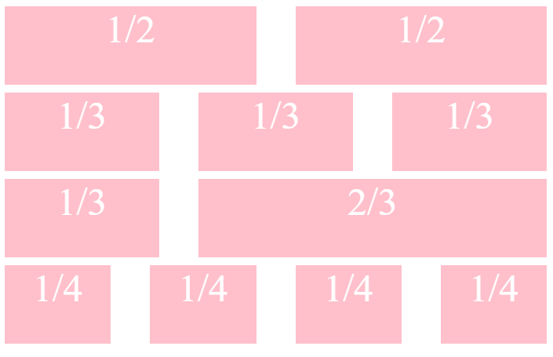
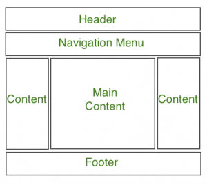

Building complex and adaptive web layouts has been super fun and easy since the release of CSS Grids and Flexbox. 

Before those, float was the main property used for building layouts and is supported across all browsers; even older versions of Internet Explorer (IE) like 8 and 9 unlike the Flex and Grid properties. If you want to build a simple layout for an audience of mainly IE users, float should be your go to tool.

*You can use the CanIUse tool to  view how compatible a property is across browsers. <a target="blank" class="inline-link" href="https://caniuse.com">CanIUse </a> is a web tool for quickly visualizing which frontend technologies are compatible with which browsers*

This article assumes that you understand how the CSS Float property works. If you don’t, you may find <a target="blank" class="inline-link" href="https://css-tricks.com/all-about-floats/">this article </a> useful.

We’ll be going through a fun exercise great for CSS beginners. You’ll use floats to build a grid column layout just like in bootstrap, that can be used across different projects. You'll also make use of some CSS concepts you may not have used before like: 
   - CSS variables.
   - CSS [attribute^=”value”] selector.
   - CSS :not(:last-child) selector.
   - CSS calc() function.

Let's get started.



Let’s start with the two column layout.

Looking at the implementation above, we can deduce that:
   - We need a row div wrapper to contain our columns
   - We need a spacing between our columns.
   - We need spacing between our rows.

The html will be:

``` html
<div class="row">
    <div class="col-1-of-2 pink">1/2</div>
    <div class="col-1-of-2 pink">1/2</div>
</div>
```

First, let’s define the spacings using Css variables aka custom properties.
 
Css variables, as the name implies, are custom properties defined by CSS developers that contain values that will be reused throughout a project. These custom property names are preceded with double dashes and are usually defined within the `:root` pseudo class.

Let's call the spacing between columns: horizontal-grid-margin and the spacing between rows: vertical-grid-margin.

``` css
:root {
    --horizontal-grid-margin: 50px;
    --vertical-grid-margin: 50px;
}
```

These variables have been defined because we will be using them across our code and if we ever need to change their values, we just need to change the variable’s value and it will be applied across our code.

*N.B: CSS variables are not yet supported on Internet explorer, so an alternative would be to simply replace the variables with the actual values or use a polyfill.*

Next, let’s define the width of rows.

*Widths will be defined in percentages, to make sure that our layout containers (i.e rows and columns) remain responsive regardless of device width.*

We’ll give rows a width of 100% to ensure that they always take up the entire widths of their containers and a bottom margin of the value of our vertical grid gap: 50px.

Next, we’ll float all divs with a preceeding  ` col- `  class name left.

We’ll be having other ` col ` clases like ` col-1-of-3 ` for a 3 column layout and ` col-1-of-4 ` for a four column layout, so we want a way to target all divs with a classname that starts with col-. 

Introducing the ` [class^=”value”] ` selector. This is a type of CSS selector like classes, ids and tags called an attribute selector that will target every element whose classname starts with the value assigned.

``` css
[class^="col-"] {
    float: left;
}
```

The code above will target all elements whose classname start with ` col- ` and float them to the left.

Also, we'll add some height and background color to our column divs to make them visible. Feel free to change these later on.

``` css
[class^="col-"] {
    float: left;
    background-color: pink;
    height: 100px;
}
```

Next, we know that we need to define some right margin value for the columns to make them spaced as what we have above. Defining a right margin value under the ` [class^=”value”] ` selector will give both columns a right margin. 

This is not what we want. We want to add spacing only between columns, not before or after. To do that, we have to give a right margin to all ` col- ` classes in a row excluding the last ones. 

Introducing the ` :not(:last-child) ` selector. This selector  basically targets all child elements of the parent element it is attached to, except the last one.

``` css
[class^="col-"]:not(:last-child) {
    margin-right: var(--horizontal-grid-margin);
}
```

Now, with the code above, we are targeting all col- classes except the last ones in a row and giving them a right margin. Cool huh?

Before we continue, we need to clear the float on the rows. When a parent element contains only floated elements like our row does, its height is collapsed to nothing instead of 100% of its children’s height. To prevent this strange behaviour, we do this:

Next we need to define widths for the columns.

From the demo gif above, we can see that both columns are of equal width.

Let’s do some logical thinking here. We can see that the combined width of both columns is the width of the row minus the margin i.e ` 100% - horizontal-grid-margin ` .This means that the individual width of each column is the total width of both columns divided by 2 i.e `(100% - horizontal-grid-margin) / 2` .But, how do we write that in CSS? 

Introducing the CSS `Calc()` function. The CSS calc function is used to perform simple calculations to determine CSS property values right in CSS.

``` css
.col-1-of-2 {
    width: calc((100% - var(--horizontal-grid-margin)) / 2);
}
```

Tada!! As you can see, we’ve successfully implemented a responsive two column layout with CSS floats.

While we’re feeling confident, let’s try to implement a three column layout.
The html will be: 

``` html
<div class="row">
    <div class="col-1-of-3 pink">1/3</div>
    <div class="col-1-of-3 pink">1/3</div>
    <div class="col-1-of-3 pink">1/3</div>
</div>
```

We’ve already written prerequisite styles for all columns. What’s needed is to define the exact width of the 3-columns.

Notice that the 3 columns are of the same width and the combined width of all 3 is the width of the row (which is 100%) minus the 2 of the horizontal-grid-margin. i.e ` 100% - 2 *  horizontal-grid-margin ` . Therefore, the width of one column is then the combined width of 3 columns, divided by 3.
i.e ` (100% - 2 *  horizontal-grid-margin)/3 ` .

``` css
.col-1-of-3 {
    width: calc((100% - 2 * var(--horizontal-grid-margin)) / 3);
}
```

Looking good huh.

Let’s challenge ourselves some more. What if we wanted a column that spanned two thirds of our 3 column layout as shown before below.

The html will be

``` html
<div class="row">
    <div class="col-1-of-3 pink">1/3</div>
    <div class="col-2-of-3 pink">2/3</div>
</div>
```

Notice that the width of the 2-of-3 column is two 1-of-3 columns plus the horizontal-grid-margin? We’ve already calculated the width of one 1-of-3 column. That will be: `2 * ((100% - 2 *  horizontal-grid-margin)/3) + horizontal-grid-margin` 

``` css
.col-2-of-3 {
    width: calc((2 *(100% - 2 * var(--horizontal-grid-margin)) / 3) + var(--horizontal-grid-margin));
}
```

That wasn't so difficult. Now, why don't you try implementing the next level which is a 4 column grid. Have a 1 of 4, 2 of 4 and 3 of 4 column class.

The pattern we’ve implemented here is highly scalable so even if you want a 20 column layout, it can handle it.

## Making Things Responsive

For responsiveness, we’re not gonna do too much.  At smaller screens - like a small tablet, we’ll use media queries to collapse all columns to stand alone and remove the right margins and add a litle spacing below each column.

``` css
@media screen and (max-width: 700px){
    [class^="col-"] {
      width: 100% !important;
    }

    [class^="col-"]:not(:last-child) {
       margin-right: 0;
       margin-bottom: var(--vertical-grid-margin);
    }
}
```

## Conclusion

We all know that the best way to learn to code, is to code.Try building out this layout below using the classes we’ve defined on <a target="blank" class="inline-link" href="https://codepen.io">codepen</a> . You can share the link to your solution on twitter and tag me with the hashtag #FloatChallenge or you can share the link in the comment section. I’ll love to see it.

<div class="inline-image">
    
</div>

*Hint: You'll need to use a 2-of-4 column*

Now, go build something great and maybe connect with me on <a target="blank" class="inline-link" href="https://twitter.com/_MsLinda">twitter</a>.
