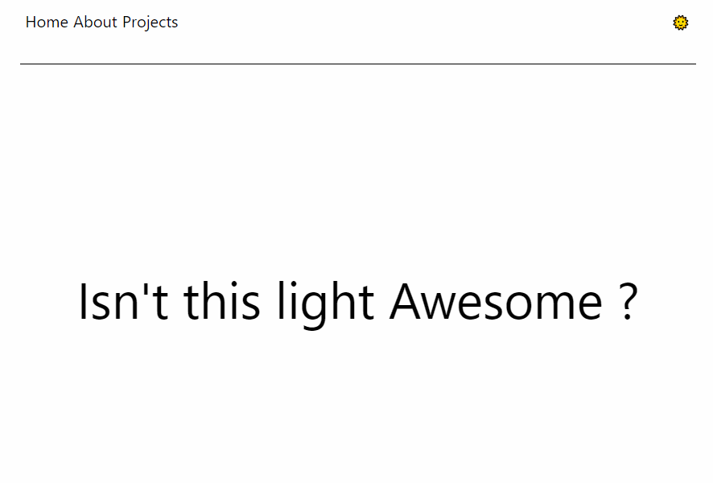

## Introduction
Giving users the ability to switch to dark mode isn’t just a nice feature to have. It also aids accessibility for those who are sensitive to bright light or have low vision or are probably in a dark room at that moment.

In this article, you’ll learn how to add a theme toggle button to switch from light mode to dark mode in a React app using the React Context API. You’ll also learn what the Context API does and how to use it, incase you don’t.

## Prerequisites
This article assumes that you have a basic knowledge of HTML and CSS. It also assumes that you have some experience writing React with JSX and some basic understanding of React Hooks.

## What is React Context?
In react applications, it is common to have a component that will need to pass a particular data or functionality to another component. This is usually done using props. The said data is passed as props from the component that owns or initializes it, to the component that needs it.

```js
const SomeComponent = () =>{
    const name = 'Linda';
    return(
        <div>
            <NameComponent user={name}></NameComponent>
        </div>
    )
}
const NameComponent = ({name}) => {
    return(
       <span>{name}</span>
    )
}

```

But, there are cases where the component that owns or initializes the data and the component that needs the data are very far apart in the app tree. In such cases, the data has to be passed down manually through all levels till it gets to the component that actually needs it.

For example, below, a `theme` variable in the `App` component needs to be used by the `ThemeToggleButton` component. The theme prop ends up being passed through to the `Homepage` and `Navigation` components (which have no use for the `theme` data), before it gets to the `ThemeToggleButton`. This is known as <a target="blank" class="inline-link" href="https://medium.com/javascript-in-plain-english/how-to-avoid-prop-drilling-in-react-using-component-composition-c42adfcdde1b#:~:text=Prop%20Drilling%20is%20the%20process,help%20in%20passing%20it%20around.&text=This%20may%20continue%20until%20the%20data%20gets%20to%20the%20ComponentNeedingProps%20.">prop drilling.<a>

```js
const App = () => {
   const theme = 'dark';
    return(
        <>
            <Homepage theme={theme} className={theme}></Homepage>
            <AboutPage></AboutPage>
        </>

    )
}

const Homepage = ({theme}) =>{
    return (
        <Navigation theme={theme}></Navigation>
    )
}

const Navigation =({theme}) => {
    return(
        <ThemeToggleButton theme={theme}></ThemeToggleButton>
    )
}

const ThemeToggleButton = ({theme}) => {
    return(
       <button>{theme}</button>
    )
}

```

The code above won’t pose so much of a problem because the `theme` prop is drilled to only 3 levels. Imagine that the `ThemeToggleButton` was 6 levels deep or greater. This could lead to errors, difficulty in tracing the flow of data and performance issues as components re-render whenever their props are updated.

So, how can this be solved? Enter React Context to save the day.

The React Context API presents a way to create global data . These data can be passed down, used by and updated by any component no matter how deeply nested it is in the app tree.

It prevents prop drilling by providing a way to pass data through the app tree without having to pass props down manually at every level to components that don't need it to render.

Don’t worry, using React Context API is as simple as following four steps:

1. Create Context
2. Provide Context
3. Consume Context
4. Update Context

You’ll learn how by building out a demo app.

## What We’ll Be Building

We’ll be building a simple web app with a button to toggle between light and dark mode. Here’s a GIF below:



All code used for this demo app can be found in this <a target="blank" class="inline-link" href="https://github.com/Linda-Ikechukwu/Blog-Posts-Demo-Apps/tree/master/dark-mode-toggler">repo.</a>

Start by bootstrapping a new react app with create-react-app

```
npx create-react-app dark-mode-toggler

```

Then create the `Navigation`, `Header`, `ToggleThemeButton` and `HomePage` components and then assemble them all in `App.js`.

```js
//in src/components/header.js
import React from 'react';

const Header = () => {
    return(
        <header className="header">
            <span>Isn't this Awesome ?</span>
        </header>
    )
}

export default Header;

```

```js
//In src/components/themeToggler.js
import React from 'react';

const ThemeToggler = () => {
    return(
        <button>
            <span role="img" aria-label="switch theme">
                🌞
            </span>
        </button>
    )
}

export default ThemeToggler;

```

```js
//In src/components/navigation.js

import React from 'react';

import ThemeToggler from './themeToggler'

const Navigation = () => {
    return(
        <nav className="nav">
            <div>
                <span>Home</span>
                <span>About</span>
                <span>Projects</span>
            </div>
            <div>
               <ThemeToggler/>
            </div>
        </nav>
    )
}

export default Navigation;

```

```js
//In src/pages/home.js
import React from 'react';

import Navigation from '../components/navigation'
import Header from '../components/header'

const HomePage = () => {
    return(
       <div>
           <Navigation/>
           <Header/>
       </div>
    )
}

export default HomePage;
```

```js
import React from 'react';

import './App.css';

import HomePage from './pages/home'

const App = () => {
  return(
      <div className="App" data-theme={theme}>
         <HomePage/>
      </div>
  )
}

export default App;

```

The App component is given a css class name of `App` and a html `data-theme` attribute with the value of a current theme. These will be used to style the entire app according to the current theme later.

## Creating a Context

To be able to pull off the light/dark mode switch, a theme value has to be made available to the parent App component because the whole app will be styled according to the current theme. The theme value also has to be passed down to the `ToggleThemeButton` which will, in turn, update the theme value whenever it is clicked thereby triggering theme switch.

This is a perfect use case for React context. To create a context, which is equivalent to initializing a sort of global state, use the `createContext` method.

```js
//In src/lib/context.js
import React from 'react';

export const ThemeContext = React.createContext();

```

## Providing The Context

Providing context means making the created context value available to child components in the parent component where it was initialized.

This is done by wrapping the child components with the `Provider` of the created context.

```js
<ThemeContext.Provider value={}>
     <div className="App">
         <HomePage/>
     </div>
</ThemeContext.Provider>

```

You can think of the provider as a caterer who prepares a buffet and makes it available to all guests at a party.

The context `Provider` wrapper accepts a `value` prop which contains data to be passed down to child components. Any child component at any level will then have access to the data contained in the `value` prop of the `Provider` as a prop.

In our case, we need a state variable to keep track of our theme and also a function to enable us to update the theme variable. We’ll do this using the `useState` hook. We then destructure the state and pass it to the context provider’s `value` prop.

```js
//in src/App.js
import { ThemeContext } from "./libs/context";

const App = () => {

  const [theme, setTheme] = useState('light');

  return(
    <ThemeContext.Provider value={{theme,setTheme}}>
      <div className="App" data-theme={theme}>
         <HomePage/>
      </div>
    </ThemeContext.Provider>

  )
}

```

Now any child, grandchild or deeply nested component will have access to use or update the `theme` and `setTheme` variables.

## Consuming Context
Consuming context simply means retrieving the data contained in the `value` prop of the context provider within another component.

You can think of consuming props as when a guest in the party gets up, grabs a plate and retrieves some food from the buffet for himself.

To consume the data contained in the `value` prop of the `ThemeContext.Provider` in the  `ThemeTogglerButton` component, we’ll make use of the `useContext` hook.

The useContent Hook accepts a context initialized with a `React.createContext` and returns the data passed in the `value` prop of the context provider.

```js
   //in src/components/themeToggler.js
  const {theme, setTheme} = useContext(ThemeContext);

```

We’ve destructured `theme` and `setTheme` from the return value of `useContext` above.

## Updating Context
Updating context is no different from the way regular state is updated. In this case, we’ll be updating the `theme` state variable, which was passed as the `ThemeContext` value by the provider wrapper.

Thankfully, `setTheme` is already available for that. Let us then write a function to switch themes when `ThemeTogglerButton` component is clicked

```js
// in src/components/themeToggler.js
const ThemeTogglerButton = () => {

    const {theme, setTheme} = useContext(ThemeContext);

    const handleThemeToggle = (e) => {
      e.preventDefault();
      setTheme(theme === 'light'? 'dark' : 'light');
    }
     return(
        <button className="themetoggler" onClick={handleThemeToggle}>
            <span role="img" aria-label="switch theme">
              {theme === 'light'? '🌞' : '🔅'}
            </span>
        </button>
    )
}

```

The `handleThemeToggler` function uses `setTheme` to update the  value of the `theme`. Remember that `theme` and `setTheme` are data of the `value` prop of  the `ThemeContext.Provider`.  So `handleThemeToggler` actually updates the global state of the context.

Now, to update the style of the app according to the current theme, we’ll use CSS variables.

```css
/*In src/App.css*/
[data-theme="light"]{
  --text-color: black;
  --background-color: white;
}

[data-theme="dark"]{
  --text-color: #fcfcfc;
  --background-color: #1d1c1c;
}

.App{
  color: var(--text-color);
  background-color: var(--background-color);
}

```

Pretty fun, huh?

Also, we’ll go ahead to consume the `ThemeContext.Provider` value in the `Header` component, just to show that the data created by context is truly global and can be accessed and used by any component as long as they’re nested inside of its provider like in `App.js`.

```js
import { ThemeContext } from "../libs/context";

const Header = () => {
    const {theme} = useContext(ThemeContext);
    return(
        <header className="header">
            <span>Isn't this {theme} Awesome ?</span>
        </header>
    )
}

```

Now the text in the header span is automatically updated according to the value of the current theme.

## Conclusion
In this article you’ve learnt how to add a light mode and dark mode switch to a react app and also what the React Context API does and how to use it. Talk about killing two birds with one stone huh?

Now, go ahead and build something great!


