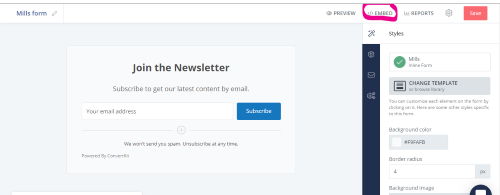
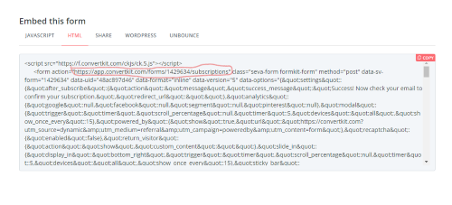

<a target="blank" class="inline-link" href=""></a>
Having an email newsletter subscription flow setup for your blog is great because it helps you retain/engage your readers and drive repeated traffic to your site amongst other reasons.

Granted, there are a couple of tools available for doing this such as Mailchimp, Aweber, Hubspot, e.t.c. Gatsby even has a plugin for using mailchimp. However, for my blog, I decided to go with <a target="blank" class="inline-link" href="https://app.convertkit.com/referrals/l/794f325a-7d4e-472d-8fbb-bdf7aa155315"> ConvertKit</a> because: 
  - There are a lot of good reviews about it.
  - The UI is really simple to use and navigate.
  - It has a free tier, so you can experiment before commiting.
  - The one and only <a target="blank" class="inline-link" href="https://monicalent.com/">Monica Lent </a>  recommended it.

This article assumes that you have some experience using <a target="blank" class="inline-link" href="https://www.gatsbyjs.org/">Gatsby</a>  or <a target="blank" class="inline-link" href="https://reactjs.org/">React.</a> 


## To get started with ConvertKit,

  1. Sign Up on <a target="blank" class="inline-link" href="https://app.convertkit.com/referrals/l/794f325a-7d4e-472d-8fbb-bdf7aa155315"> ConvertKit</a>.

  2. Click on 'Landing Pages and forms' > 'Create New'.

  3. Click on 'Form' and select the 'inline' display format option.

  4. Choose any template you fancy. I chose the Mills template.

  5. Click on 'Embed'
    <div class="inline-image"></div>

  6. Click on 'Html' and take note of the form’s action url and the names of input tags present (scroll, look closely and you’ll find them). We’ll be using them later.
    <div class="inline-image"></div>


## Integrating With Gatsby

Due to the way Gatsby is written, you can’t directly embed the 'script tag' or the 'HTML' options into your code. The easiest way is to create a custom subscription form as a component.

```jsx

//In src/components/sub-form.component.js
import React, { useState } from 'react';
import Button from "../button/button.component";

const SubscriptionForm = () => {
    const [status, setStatus] = useState(null);
    const [email, setEmail] = useState('');

    //FORM_URL should be the same as the form action url pointed out above
    const FORM_URL = `https://app.convertkit.com/forms/1417892/subscriptions`;

    const handleSubmit = async (e) => {
        e.preventDefault();
        const data = new FormData(e.target);
        try {
            const response = await fetch(
                FORM_URL,
                {
                    method: 'post',
                    body: data,
                    headers: {
                        accept: 'application/json',
                    },
                }
            );
            setEmail('');
            const json = await response.json();
            if (json.status === 'success') {
                setStatus('SUCCESS');
                return;
            } 
        } catch (err) {
            setStatus('ERROR');
            console.log(err);
        }
    };

    const handleInputChange = event => {
        const {value} = event.target;
        setEmail(value);
    }

    return (
        <div className="sub">
            <h2>Join My Newsletter</h2>
            <p>
               If you've found any of my articles useful, subscribe to receive more quality articles straight to your inbox.
            </p>
            
            {status === 'SUCCESS' && <p>Please go confirm your subscription!</p>}
            {status === 'ERROR' && <p>Oops, Something went wrong! try again.</p>}
            
            <form className="sub__form"
                action={FORM_URL}
                method="post"
                onSubmit={handleSubmit}
            >
                <input
                    type="email"
                    aria-label="Your email"
                   //The name attribute should be the same as on you selected form.
                    name="email_address"
                    placeholder="Your email address"
                    onChange={handleInputChange}
                    value={email}
                    required
                />

                <Button type="submit">
                    Subscribe
                </Button>

            </form>

            <p className="sub__tag">I won't send you spam and you can unsubscribe at any time</p>

        </div>
    );
};

export default SubscriptionForm

```


You can style the subscription form component however you want, then import and use it in your blog pages template file or wherever else you wish. 

<strong>To Test:</strong> Enter an email address into your form and click on the subscribe button. If you receive a success message and confirmation email to that email address then you’re good to go.

*P.S: This should be done on a live site not on localhost.*

You can also make changes to the contents of the confirmation email, tweak other settings for your form, and create an email template for your broadcasts. 

I’m hoping you’ll figure your way around. If you have any further questions, ask away in the comment section or hit me up on <a target="blank" class="inline-link" href="https://twitter.com/_MsLinda?">twitter</a> 

Now go on and build something great!


