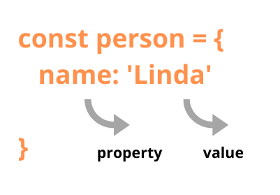

One of the first topics you’ll come across when learning JavaScript (or any other programming language) are operators.

The most common operators are the arithmetic, logical, and comparison operators. But did you know that JavaScript has an in operator?

If you didn't, don’t fret. I just came across it recently while searching for a solution to a problem on Google.

In this article, you’ll learn exactly what the JavaScript in operator does, when to use it, and how to use it.

## What exactly is the JavaScript in operator?
The JavaScript in operator is used to check if a specified property exists in an object or in its inherited properties (in other words, its prototype chain). The in operator returns true if the specified property exists.

<div class="inline-image">
  
  <span>Anatomy of a Simple JavaScript Object</span>
</div>

The JavaScript prototype chain is how objects or object instances have access to properties and methods that were not originally theirs. These objects inherit properties and methods defined in their constructors or prototypes, which can be accessed through their `__proto__` property.

This article assumes that you have a basic understanding of what objects are, how to create them, what they are used for, and how JavaScript inheritance works. If you don’t, this <a target="blank" class="inline-link" href="https://developer.mozilla.org/en-US/docs/Learn/JavaScript/Objects/Object_prototypes">article on MDN should help.</a>

## When to use the JavaScript in operator

### 1. To verify if a property exists on an object

```js
const car = {
  make: 'Toyota',
  model:'Camry',
  year: '2018',
  start: function() {
    console.log(`Starting ${this.make} ${this.model}, ${this.year}`);
  }
}

'make' in car // Returns true.
'start' in car // Returns true.
'Toyota' in car // Returns false. 'Toyota' is not a property name, but a value.

```

## 2. To verify if a property is inherited by an object.
Let’s use the ES6 class syntax to create an object constructor. This would also apply to function constructors:

```js
class Car {
  constructor(make, model, year) {
    this.make = make;
    this.model = model;
    this.year = year;
  }
  start() {
    console.log(`Starting ${this.make} ${this.model}, ${this.year}`);
  }
}

const 2 .toyota = new Car('Toyota', 'Camry', '2018');

/* Returns true as toyota is an instance of the Car object constructor.
The toyota object therefore inherits all properties of the Car constructor. */
'start' in toyota;

/* Returns true. toString is a method property of the Object type,
of which the Car constructor is an instance of. */
'toString' in toyota;

```

### To verify if an index/key exists on an array.
You might be wondering, since we established that the JavaScript `in` operator can be used with objects, why can we also use it with arrays?

Well, an array is actually a prototype (instance) of the `Object type`. In fact, everything in JavaScript is an instance of the `Object` type.

That may sound crazy, but lets run a simple program in the browser's console to confirm.

First, define an array and confirm if its an instance of the `Object` type using the `instanceof` operator:

```
  const number = [2, 3, 4, 5];

  number instanceof `Object` // Returns true
```

Still in doubt? Type number into the console and press enter, then open up the output.

You’ll notice a list of properties, one of which is `__proto__` which points to Array. Opening that too and going down that list bring us to another `__proto__` property with a value of Object.

That shows that the number array is an instance of the Array type which is an instance of the `Object` type.

Now, back to using the in operator:

```js
const number = [2, 3, 4, 5];

3 in number // Returns true.
2 in number // Returns true.

5 in number // Returns false because 5 is not an existing index on the array but a value;

/* Returns true because filter is a method property on the Array type of which the number array is an instance of.
The number array inherits the filter property.*/
'filter' in number

```

### To verify if a property exists on a Html element
In Kirupa's article, Check If You Are On a Touch Enabled Device, he highlights this function:

```js
function isTouchSupported() {
  var msTouchEnabled = window.navigator.msMaxTouchPoints;
  var generalTouchEnabled = "ontouchstart" in document.createElement("div");

  if (msTouchEnabled || generalTouchEnabled) {
    return true;
  }
  return false;
}
```

This function returns true if you are on a device that supports touch and returns false if you are on a device that doesn't support touch by checking if the properties window.navigator.msMaxTouchPoints and ontouchstart are present. These properties only exist on devices that are touch enabled.

Pretty straightforward!

Lets focus on the highlighted line. Remember how we established that the in operator returns true if the specified property exists in an object? HTML elements used in JavaScript actually become instances of the `Object` type, hence the name "Document Object Model" or DOM.

Of course, you might not believe me without some sort of proof. As before, let’s type some commands into the console.

Create a div element and list out its properties using `console.dir()`:

```js
 const element = document.createElement('div');

 console.dir(element);
```

You'll then see the div element with its properties listed in the console.

Open the drop down and you’ll notice that it has a `__proto__` property of HtmlDivElement. Open that and you’ll find another `__proto__ `property of HtmlElement, then Element, Node, Eventtarget, and finally `Object`.

Also run:

```js
  element instanceof Object
```

This will return true, showing that the div element is an instance of the `Object` type, which is why the in operator can be used on it.

## Conclusion

You’ve learned about the not so popular JavaScript in operator, which is used to verify the presence of properties on an object or `Object` type instances. This should come in handy when writing verification logic.

If you liked this article, you’ll definitely like other articles on this blog, You can hit me up through the comment section or <a target="blank" class="inline-link" href=""> twitter. </a>

Now, go build something great!