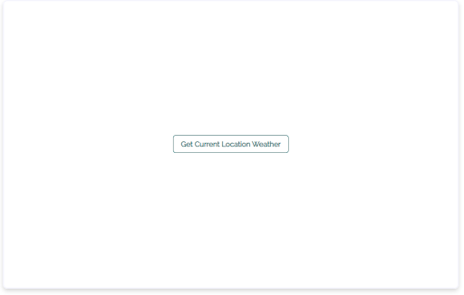
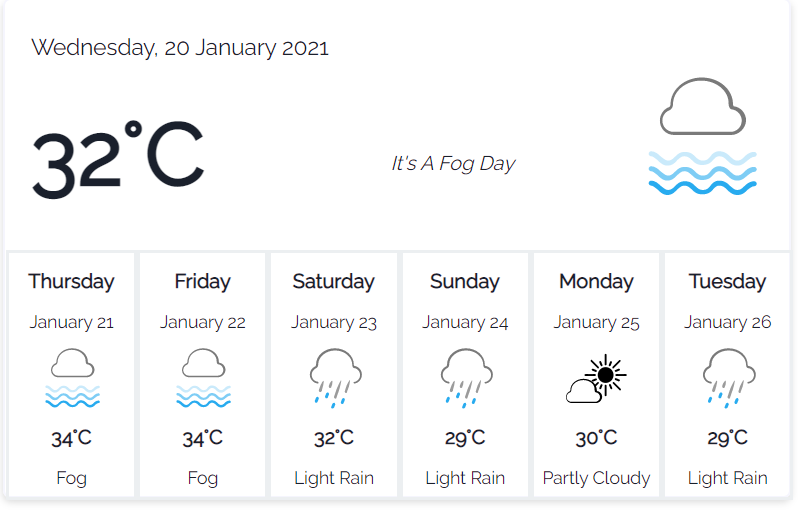

<a target='blank' class="inline-link" href=""></a>
If you’ve just learned the fundamentals of React, the best way to solidify your learning is to build a pet project with all that knowledge. A typical pet project featured by most tutorials is the reverend to-do list. This time, let’s step away from that and try to build something more fun: a weather widget.

To build this weather widget, we’re going to be using the following tools/libraries:

- <a target='blank' class="inline-link" href="https://create-react-app.dev/docs/getting-started/">Create React App</a>: Toolchain for quickly setting up React SPAS
- <a target='blank' class="inline-link" href="https://day.js.org/">Day.js</a>: A lightweight JavaScript Library for date and time formatting and manipulation
- <a target='blank' class="inline-link" href="https://www.climacell.co/weather-api/">ClimaCell Weather Api</a>: all-in-one free weather API
- <a target='blank' class="inline-link" href="https://www.npmjs.com/package/axios">Axios</a>: Promise based library for making HTTP requests straightforward
- <a target='blank' class="inline-link" href="https://chakra-ui.com/">Chakra UI</a>: Modular component library for building react apps faster

Our weather widget will have the following features:

- Retrieve users’ current GPS location in latitude and longitude with the HTML5 Geolocation API
- Make API calls to retrieve and display 7-day weather (temperature) forecasts specific to users’ location.
- Display weather conditions for each day with a temperature reading, a short description of the weather condition, and a weather icon that best depicts the weather condition for the day

This tutorial is ideal for beginner React developers who need a quick project to whip up to solidify their learnings. It assumes that you have a basic understanding of React hooks (useState and useEffect), Javascript, and Sass. If you don’t, then you may want to skip reading this tutorial.

In this tutorial, you’ll learn, amongst other things, how to:

- Get a user’s current location with HTML5 Geolocation API.
- Why and how to hide API keys in React
- How to set up Chakra UI for React projects

I hope you’re excited! Let’s get started by first setting up a react boilerplate with create-react-app.

## How to set up a React app

To get started, navigate into any folder where you want your  project to live, and using your preferred terminal, run the following command:

```
npx create-react-app react-weather-widget
cd my-app
npm start
```

This sets up a react boilerplate app with all the basic things you’ll need. You can go ahead and delete all the unnecessary files in `src` and codes in `App.js`, `App.css`, and `index.scss`. After that is done, the next step is to sign up for a ClimaCell developer account to use their API.

## How to use the ClimaCell Weather API

<a target='blank' class="inline-link" href="https://www.climacell.co/weather-api/">ClimaCell</a> is a weather data provider with a microweather API that offers more accurate weather data than other weather data providers. It collates data from traditional weather data sources like the National Oceanic and Atmospheric Administration (NOAA) alongside new sensing technologies - including cell towers - not used by anyone else. The ClimaCell weather API is a great choice for whatever weather data you may need when building an application. From core weather data like temperature, precipitation, and humidity, to rarer weather data like pollen, air quality, road risk, and fire risk index, ClimaCell provides it all.

To use the API, we’ll need to sign up for an account to obtain a secret API key, which will authenticate our requests.

To register an account, head over to their <a target='blank' class="inline-link" href="https://www.climacell.co/pricing">pricing page</a>
 and click on “sign up” on the free developer plan. After providing the necessary information, you’ll be redirected to your dashboard, where you’ll find your secret API key.

The ClimaCell API has different endpoints for achieving various tasks, but the one we’re interested in is the timeline endpoint: https://data.climacell.co/v4/timelines. This endpoint returns either real-time or historical weather data for a particular geographical location, based on the optional `starttime` and `endtime` parameters passed. Other query parameters we need to pass to it include:

- Location: string value of the latitude and longitude of the location we wish to read weather data from, e.g., “27.2046,77.4977”. For our app, we’re not going to hardcode this, so we need to devise a way to get the users’ current lat and long geographical positions. More on this later.
- Fields: weather fields that should be returned by the API. For us, we’re only interested in ‘temperature’ and `weatherCode.`
- Timestamps: Intervals. Since we’re interested in daily weather readings, this would be ‘1d’.
- apiKey: secret key on your dashboard.

In summary, the endpoint we’ll make a GET request to, will look like:

```
https://data.climacell.co/v4/timelines?location=${location}&fields=temperature&timesteps=1d&units=metric&apikey=${your-api-key}

```

We currently have values for all required query parameters, except the user’s current location. How do we get that?

## How to get current location HTML5 Geolocation API

HTML5 has a native <a target='blank' class="inline-link" href="https://developer.mozilla.org/en-US/docs/Web/API/Geolocation_API">Geolocation API</a> that can be used to retrieve the location of users (with their permission) by retrieving a user’s device GPS information. The location is retrieved in terms of longitude and latitude via `navigator.geolocation.getCurrentPosition()`.

The `getCurrentPosition` method takes in a success and error callback function. Both callback functions take in results from the `getCurrentPosition` method as their only parameters.

To implement in our project, In App.js:

```js
import React, { useState, useEffect } from 'react';
import axios from 'axios'
import './App.scss';

function App() {
  const [loading, setLoading] = useState(false);
  const [isLocationExist, setIsLocationExist] = useState(false);
  const [errorMessage, setErrorMessage] = useState("");
  const [weatherData, setWeatherData] = useState([]);

  const onSuccessLocation = async (position) => {
    const location = `${position.coords.latitude}%2C${position.coords.longitude}`;
    localStorage.setItem('location', location);
    await getWeatherData(location);
    setIsLocationExist(true);
    setLoading(false);
  }

  const onErrorLocation = (err) => {
    setErrorMessage(`Failed to locate. Error: ${err.message}`);
  }

  const getLocation = () => {
    if (navigator.geolocation) {
      setLoading(true);
      navigator.geolocation.getCurrentPosition(onSuccessLocation, onErrorLocation);
    } else {
      setErrorMessage('Sorry. Geolocation is not supported by this browser.');
      setLoading(false);
    }
  }

  const getWeatherData = async (location) => {
    setLoading(true);
    const url = `https://data.climacell.co/v4/timelines?location=${location}&fields=temperature&fields=weatherCode&timesteps=1d&units=metric&apikey=${process.env.REACT_APP_CLIMACELL_API_KEY}`;
    try {
      const response = await axios.get(url);
      if (response.data) {
        setWeatherData(response.data.data.timelines[0].intervals.slice(0, 7));
        setLoading(false);
      }
    } catch (error) {
      setLoading(false);
      setErrorMessage(error.message);
    }

  }

  useEffect(() => {
    setLoading(true);
    const location = localStorage.getItem('location');
    if (location) {
      setIsLocationExist(true);
      getWeatherData(location);
    }
    setLoading(false);
  }, [])

return (
  …..
)}
```


In the code block above,
- `getLocation` checks if the user’s browser supports the geolocation API. If it does, we call the `getCurrentPosition` method, passing in the `onSuccessLocation` and `onErrorLocation`
callback functions.
- `onSuccessLocation` retrieves a `GeolocationPosition` object from `getCurrentPosition` and forms a location string with latitude and longitude, stores it in localStorage and then calls the `getWeatherData` function. Note that `%2C` is the URL encoding character for the comma.
- `getWeatherData` makes a get request to our API endpoint using Axios and stores the response in the state. We’re using Axios because it provides a straightforward interface for making API requests (no JSON conversion, no cross-site errors, e.tc).  Install Axios by running `npm install Axios.` By default, the ClimaCell daily timeline API endpoint returns weather data for 14 days from the current day. We use the splice array method to get only the first seven that we need. You’ll also notice that we have hidden our API key and referenced it with `process.env.REACT_APP_CLIMACELL_API_KEY`. Let’s look at how to hide API keys in the next section.

## How & why to hide your API keys
In software development, It’s a security best practice to hide your API keys to prevent information hijacking and other security damages. To hide API keys in react projects:

1. Create a .env file in your project’s root folder
2. Add .env to your gitignore file. What’s the purpose of hiding your key if it gets pushed to GitHub for all to see?
3. Inside the .env file, create a variable to store your API key:

```
REACT_APP_CLIMACELL_API_KEY = 'your-api-key'
```

 N.B: The variable name must be prepended by REACT_APP_ as REACT_APP_is, in fact, a tool that create-react-app uses to identify environment variables.
4. Access the API variable via the `process.env` object

For production, you can use your hosting platform’s (e.g., Netlify) key management service to store your keys. Next, let’s write some JSX to set up the UI of the weather widget.

## How to Use Chakra UI in React applications.

As I mentioned, Chakra UI is a simple, modular and accessible component library that provides the building block components needed in building React applications. We’ll be using it to quickly set up features that we’ll use in our weather widget like <a target='blank' class="inline-link" href="https://chakra-ui.com/docs/form/button">Button</a>
, <a target='blank' class="inline-link" href="https://chakra-ui.com/docs/feedback/progress">Progress Loader</a>
, and <a target='blank' class="inline-link" href="https://chakra-ui.com/docs/feedback/alert">Alerts popups.</a>


To set up Chakra UI for in React project, simply run:

```
npm i @chakra-ui/react @emotion/react @emotion/styled framer-motion
```

Then, in index.js, add the `ChakraProvider` component:

```js
import React from 'react';

import { ChakraProvider } from "@chakra-ui/react"

ReactDOM.render(
  <ChakraProvider>
    <App />
  </ChakraProvider>,
  document.getElementById('root')
);
```

Now in App.js, import the necessary components:

```js
import WeatherCards from "./Components/WeatherCards";
import WeatherToday from "./Components/WeatherToday";
import {
  Button,
  Progress,
  Alert,
  AlertIcon,
  AlertTitle,
  AlertDescription,
  CloseButton,
} from "@chakra-ui/react"

const App = () => {

<div className="weather-app">
      {
        loading === true ?
          (
            <div className="weather-app-loader">
              <Progress isIndeterminate hasStripe value={44} size="md" />
            </div>
          ) :
          !isLocationExist ?
            (
              <div className="weather-app-home">
                {
                  locationError !== "" && (
                    <Alert status="error">
                      <AlertIcon />
                      <AlertTitle mr={2}>{errorMessage.split(".")[0]}.</AlertTitle>
                      <AlertDescription>{errorMessage.split(".")[1]}.</AlertDescription>
                      <CloseButton position="absolute" right="8px" top="8px" />
                    </Alert>
                  )
                }
                <Button colorScheme="teal" variant="outline" onClick={() => getLocation()}>
                  Get Current Location Weather
                </Button>
              </div>
            ) :
            weatherData.length ?
            (
              <>
                <div className="weather-today">
                  <WeatherToday currentWeather={weatherData[0]} />
                </div>
                <div className="weather-cards">
                  <div><WeatherCards weatherData={weatherData.slice(1, 7)} /></div>
                </div>
              </>
            ) :
            (
              <div className="weather-app-error">
                <p>{errorMessage}. Please try reloading the page</p>
              </div>
            )
        }
    </div>
  )
}


export default App;
```

In the JSX code above, we’re using <a target='blank' class="inline-link" href="https://www.digitalocean.com/community/tutorials/7-ways-to-implement-conditional-rendering-in-react-applications">conditional rendering</a> to render different UI components based on other states’ condition. What we’re doing can be described as using chained  <a target='blank' class="inline-link" href="https://www.javascripttutorial.net/javascript-ternary-operator/">ternary operators</a>.

```js
condition ? (do this) ? condition ? (do this) ? condition ? (do this) : (do this)
```

If the loading state is set to true, we show the loading icon to let the user know that information is being loaded. If the location does not exist, we offer the `Get current weather position` button, and when the  `weatherData` has loaded, show the weather info with `weatherCards` and `WeatherToday` components. Else if none of the conditions are true, show the error.

Here’s what our weather widget looks like before `weatherData` exists:



Clicking on the button gets the user’s current position, stores it in localStorage, and then loads the weather data.

The `WeatherCards` and `WeatherToday` components show the content of the response data from ClimaCell Weather API like the date, temperature, weather status, weather icon.

In src, create a Components folder and create two files: WeatherCards.js and WeatherToday.js. In WeatherCards.js:

```js
import React from 'react';
import dayjs from 'dayjs';
import getIcon from '../WeatherIcons/icons'
import "../Styles/weathercard.scss"

const WeatherCards = ({weatherData}) =>{
  return(
    <>
      {weatherData.map((day,i) =>{
        return(
          <div className="weather-card" key={day.startTime}>
            <p className="weather-card-day">{dayjs(day.startTime).format('dddd')}</p>
            <p>{dayjs(day.startTime).format('MMMM DD')}</p>
            
            <p className="weather-card-temp">{Math.round(day.values.temperature)}°C</p>
            <p>{getIcon(day.values.weatherCode).text}</p>
          </div>
        )
      })}
    </>
  )
}

export default WeatherCards;
```

In WeatherToday.js:

```js
import React from 'react';
import dayjs from 'dayjs';
import getIcon from '../WeatherIcons/icons'
import "../Styles/weathertoday.scss"

const WeatherToday = ({ currentWeather }) => {
    return (
        <>
            <div className="current-weather" key={currentWeather.startTime}>
                <div>
                    <p className="current-weather-day">{dayjs(currentWeather.startTime).format('dddd, DD MMMM YYYY')}</p>
                    <p className="current-weather-temp">
                        {Math.round(currentWeather.values.temperature)}
                        <span>°C</span>
                    </p>
                </div>
                <p className="current-weather-status">It's A {getIcon(currentWeather.values.weatherCode).text} Day</p>
                
            </div>

        </>
    )
}

export default WeatherToday
```

In both components, we’re using the lightweight dayjs library to format the date data returned in ISO format into a more readable format.

Unfortunately, Climacell does not have an API for retrieving <a target='blank' class="inline-link" href="https://github.com/climacell-api/weather-code-icons">corresponding weather icons</a> but, they have a collection of weather icons with corresponding <a target='blank' class="inline-link" href="https://docs.climacell.co/reference/data-layers-core">weather codes</a> which is accessible via the `weatherCode` params.

I downloaded a couple that I need in svg formats and put all of them in `src/WeatherIcons`. Also in the `WeatherIcons` folder, create an `icons.js` file and write this:

```js
import FreezingRain from './freezing-rain.svg';
import IcePellets from './ice-pellete.svg';
import Snow from './snow.svg';
import Thunderstorm from './thunderstorm.svg';
import RainHeavy from './rain-heavy.svg';
import Rain from './rain-moderate.svg';
import Fog from './fog.svg';
import Cloudy from './cloudy.svg';
import PartlyCloudy from './partly-cloudy.svg';
import Clear from './clear-day.svg';

const getIcon=(weatherCode)=> {
    switch (weatherCode) {
        case 6000:
        case 6001:
        case 6200:
        case 6201:
            return {text:"Freezing Rain", icon:FreezingRain};
        case 7000:
        case 7101:
        case 7102:
            return {text:"Ice Pellets", icon:IcePellets};
        case 5000:
        case 5001:
        case 5100:
        case 5101:
            return {text:"Snow", icon:Snow};
        case 8000:
            return {text:"Snow", icon:Thunderstorm};
        case 4000:
        case 4001:
        case 4200:
            return {text:"Light Rain", icon:Rain};
        case 4201:
            return {text:"Heavy Rain", icon:RainHeavy};
        case 2000:
        case 2100:
            return {text:"Fog", icon:Fog};
        case 1001:
        case 1102:
            return {text:"Cloudy", icon:Cloudy};
        case 1101:
        case 1100:
            return {text:"Partly Cloudy", icon:PartlyCloudy};
        case 1000:
            return {text:"Clear Day", icon:Clear};;
        default:
            return null;
    }
}

export default getIcon;

```

The `getIcon` function takes in the `weatherCode` returned from the API requests and returns a corresponding icon.

Here’s what the weather widget looks like:



N.B: All the code used in this tutorial can be found in my <a target='blank' class="inline-link" href="https://github.com/Linda-Ikechukwu/Climacell-weather-widget">GitHub repo</a>.

## Conclusion

Tada! You’ve successfully built a react weather widget with the ClimaCell weather API while also learning some new concepts - I hope.

Now, as we all know, the best and fastest way to learn is by doing. This tutorial is a great start, but I’ll advise you to make further improvements to the widget to get more practice on your own.

Some improvements ideas include:

- Show weather data for 1-hour or 3-hour intervals for the current day alongside the average daily reading, just like the google weather widget. Use the 1h timestamp query on the API.
- Make the widget interactive. Clicking on individual day weather cards should show the weather data for that day on top alongside corresponding 1-hour or 3-hour intervals below it.
- Use the Google <a target='blank' class="inline-link" href="https://developers.google.com/maps/documentation/geocoding/overview#Geocoding">Geocoding API</a> to  <a target='blank' class="inline-link" href="https://developers.google.com/maps/documentation/geocoding/overview#ReverseGeocoding">reverse-geocode</a> the latitude and longitude reading and get the user’s city name. You can display this on the top part of the UI.
- Convert the widget into a PWA, so it can easily be installed on your mobile device, and host it on a platform like Netlify, so your friends can use it as well :)

That’s it. Go now and build something great!


                                       -----
<em>This article was sponsored by the guys at climacell :)</em>


