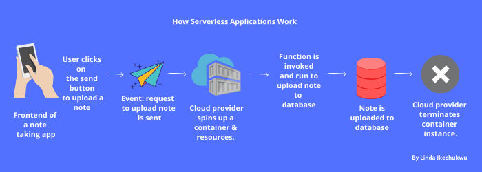

## Introduction

The word ‘serverless’ -  it’s everywhere. Infact, according to google trends, the word is googled an average of 100 times daily. Is serverless just a buzzword? a facade? or a world where we won’t need servers anymore?

Before completing my Cloud Developer Nanodegree program from Udacity, I too didn’t fully understand what serverless really meant. It sounded abstract and most of the articles I read were filled with a lot of technical jargon that just didn’t make sense. I ended up concluding that severless was just something the 10X developers came up with to remind us mere mortals of our status.

Luckily, I now know better and that is not the case. In this article, I’ll explain what the term Serverless (or Serverless Computing in full) means using a booking an uber ride analogy.

If you’ve ever booked and used an uber ride, then you can understand the concept of Serverless.

## Using an Uber

You may be wondering, what does an uber have to do with serverless? You’ll see, just stay with me.

Let’s assume that your friends have invited you to a little weekend retreat at a spot uptown.

You don’t have a car. Taking the bus or taxi means you’ll have to make drops at about 3 bus stops to get to your destination. Your feet will hurt due to all that standing in your heels and you may probably break a sweat which will ruin your makeup. Stressful !

You think of renting a car. You’ll have to pay for renting the car for 4 days when you’ll really only be driving the car for 3 hours in total because you won’t be doing any driving at the retreat. You just need to get there and leave there at the end of the weekend. Waste of money!

Ok, maybe you have a car. But, the tyre's bad. You’ll have to fix that, wash it, top up water and oil, get fuel and do other car maintenance stuff. More stress!

Urgh! Isn’t there a way to just get to the retreat without having to worry about all these transportation stuff?

That’s where Uber comes in. So, you download the app.

***" Focus on getting to your destination, Let someone else bring the car and also drive you. "***

You enter your destination into the app and click the book button. This triggers a request and the app responds to your request by allocating a driver and a car to you.

Midway through your Uber ride, you get a call from your friends. They’ve somehow moved the venue of the retreat to the beach house. No cause for alarm. Using an uber is highly scalable so you just change your intended destination on the app and the trip is adjusted.

Finally, you’ve gotten to your destination - the beach house.The trip ends and you only pay for the duration of your trip and the distance covered.

That was definitely so much less stressful and cost-effective. You didn’t have to buy a new car or rent a car for the whole weekend that you were barely going to use.

Just like the uber ride experience, Serverless tries to make life easier for developers so they can focus on doing what they know how to do best - write code, without having to worry about the nitty gritty of how the code will be deployed to intending users.

To really understand the problems that serverless tries to solve, let’s go back in time.

## A Little Computing History

Development workflows have massively evolved over time. In the past, if a developer or a company wanted to deploy and host an application - say an online store, physical servers and storage hardware had to be purchased. These hardwares had to be configured and supplied power 24/7 before applications could be deployed on them. After deployment, the hardwares had to be maintained and updated regularly too.

Now, times will come when usage of the online store may spike, for example during black fridays and holiday seasons. To cope with the increased requests, the developer or company would normally have existing pre-configured standby idle servers for such times; just like having to rent a car that you’ll barely use.

If requests exceeded the capacity of available hardwares, then new hardwares had to be purchased, configured and whatnot, which takes time, and during which users will be lost.

This method encouraged a lot of money and time wastage, and was totally not scalable for smaller companies and individual developers.

Things got better as Cloud computing and Infrastructure as a Service (IaaS) was introduced. With IaaS, computing resources (servers, storage, e.t.c) could be bought instantly, configured and managed over the internet. This greatly reduced costs and eliminated the need for tedious hardware handling and other overheads such as electricity.

Although IaaS offered a lot of improvements compared to the previous model, a couple of pain points still existed:

- Provisioned servers and other resources are paid for whether they were being used or not.
- Servers have to be scaled up when there is a surge in requests and scaled down during peaceful times to avoid resource wastage   and incurring charges.
- The responsibility of maintaining, updating and securing the servers still fell on the developers.

For an individual developer or small organisation without a dedicated team to oversee all these, I’m sure that you can see how this would be a lot to handle. These tasks could end up distracting and slowing down the development of the actual application. That is why serverless was introduced.

## So, What is Exactly is Serverless?

Before you ask, No, serverless doesn’t mean that applications are now deployed without servers. Serverless is simply a development approach that allows you to focus on building your applications while a cloud provider takes care of provisioning, managing, maintaining, and auto-scaling servers that your applications will run on.

***“ Focus on building your application, Let someone else be your DevOps. ”***

A widely accepted technical definition of serverless is:

Serverless is an event-driven, ephemeral and stateless cloud-based architecture that dynamically allocates machine resources.

Huh! What does all that even mean?

In serverless, applications are architected following a modular microservice approach. Different services that make up the whole app are written and deployed as individual functions - hence, the term `Functions as a Service (FaaS)’.

For example, consider a simple inventory application where users can add new entries which will be uploaded to a database for keeps. Users can see all their entries or can view details of a single entry and can also delete a particular entry. In severless, the functionality of this inventory application can be deployed as 4 functions : `addEntries`, `getEntries`, `getAllEntries`, and `deleteEntries`.

These functions will only be triggered and run in response to a specified event e.g clicking a button to upload an entry to a database. Just like you’ll only be matched with an uber ride when you send a booking request by clicking a button.

When an event that triggers a function is received, the cloud provider automatically spins up a container alongside other resources in which the function is deployed and runs on. These functions are typically stateless i.e they do not store any context from a previous execution. The containers in which functions are run on are ephemeral i.e as once the function does its job, the container is typically destroyed almost immediately. It is safe to assume that for every request a new container is spun-up.

In addition to using the FaaS approach, serverless applications also outsource much of the backend load to cloud-hosted managed backend services for features like database management (Firebase, AWS DynamoDB), authentication (Auth0, AWS Cognito), push notifications (Amazon SNS, Google’s FCM) enabling developers to focus on writing code that users will actually interact with and improve UX. This is known as Backend as a Service (BaaS).

***"In summary, Serverless = FaaS + BaaS"***

With Serverless, all of the challenges that existed with the previous eras are taken care of:

- No more paying for idle time. You only pay when your functions are run in response to a request which is more cost effective.
- No more server management. No need to provision or install any software or runtime on servers, the cloud provider does that for you.
- No more scalability issues. Function instances are automatically spun up as new requests are received.
- No more service downtime. Inbuilt high availability and fault tolerance.

Do you now see how building a serverless application offers a similar experience to booking an uber ride? They both abstract stress from our lives and let us focus on the things that actually matter.

## Conclusion
I hope I have successfully helped you understand what serverless means. Why not try building one? If you want to learn more about serverless, below are some resources for you.

Also, let me know what you think of this writing style in the comment section. Now, go on and build something great !

## More Resources on Serverless

- <a target='blank' class="inline-link" href="https://blog.logrocket.com/benefits-trade-offs-serverless/">When Should You Choose  Serverless?</a>
- <a target='blank' class="inline-link" href="https://aws.amazon.com/serverless/#Serverless_application_use_cases">Serverless  Application Use Cases</a>
- <a target='blank' class="inline-link" href="https://serverlessrepo.aws.amazon.com/applications">Example Serverless Applications</a>
- <a target='blank' class="inline-link" href="https://github.com/serverless/examples">More Example Serverless Apps and Boilerplates</a>
- <a target='blank' class="inline-link" href="https://serverless-stack.com/">A Guide to Building Full Stack Serverless Apps</a>