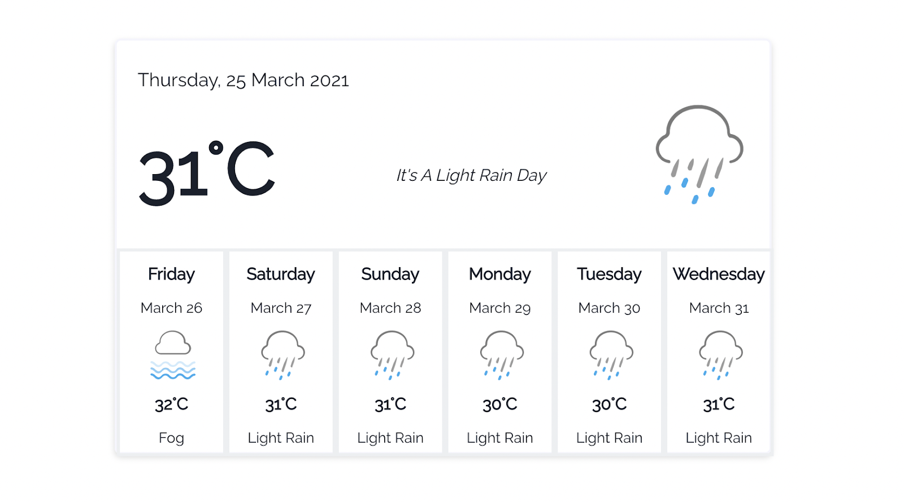
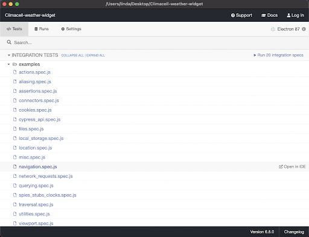
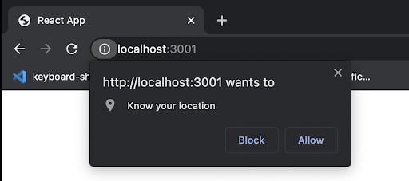
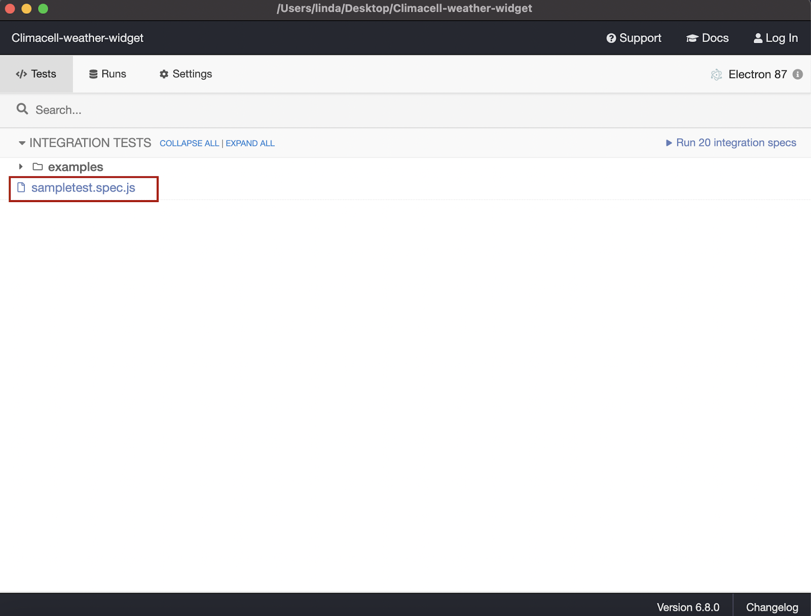
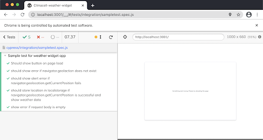
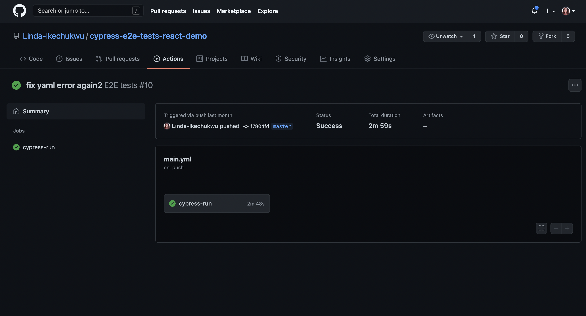

Modern applications are always evolving in order to continue to meet its users' needs. Developers who work on such applications will continually push code updates to the codebase. This could be in terms of maintenance, bug fixes, refactors, or new features. How do you ensure that new code additions don’t break the existing codebase?

The obvious answer is testing. Testing helps identify defects or bugs before they get to production and ensures that the end user’s application is reliable. Does that mean you have to manually test all the flows and processes in the entire application every time you add new code? This may be possible for minor applications with few processes, but what about large complex applications with numerous processes? Enter automated tests .

With automated tests, you write code to test your application using a testing framework for your programming language. These tests can then run whenever without any additional inputs. There are different types of automated tests: unit tests, integration tests, end-to-end tests, and so on, but our focus for this article is end-to-end tests. We’ll look at how to test React applications using Cypress.

## What Are End-to-End Tests?

End-to-end (E2E) tests examine entire user flows from beginning to end to verify they conform to expected behaviors. One example of a user flow is the whole process of purchasing an item with an e-commerce application: select item, view details, add to cart, check out, and pay. E2E tests simulate real user scenarios and ensure the app works exactly the way the user expects.

E2E tests are ideal for testing critical workflows and verifying that they work well at all times. If you’re considering testing an already existing application, it’s best to start with E2E tests. Cypress is a wonderful testing framework choice for web applications.

## What is Cypress?

<a target='blank' class="inline-link" href="https://www.cypress.io/">Cypress</a> is a JavaScript E2E testing framework for fast and reliable testing of anything that runs in a browser. This means that you can only write Cypress tests in JavaScript, and it can only test web applications.

Despite that, compared to other testing frameworks like Selenium, Cypress tests are less flaky and easier to learn, set up, and write. 

In this article, you'll learn how to write E2E tests for a React app using Cypress.

## Testing a Sample React App with Cypress: Setting Up Cypress

Since the focus of this article is on how to write end-to-end tests for React apps with Cypress, we’ll test an existing demo React weather widget app. I built this while writing an article on <a target='blank' class="inline-link" href="https://www.codewithlinda.com/blog/react-weather-widget-with-climacell/">how to build a React weather widget app</a>.

To get started, fork and clone the <a target='blank' class="inline-link" href="https://github.com/Linda-Ikechukwu/Climacell-weather-widget.git">repo</a> into your local device.


<p class="inline-image-subtitle">Screenshot of weather widget app</p>

Open the project in your code editor, install dependencies, and launch it:

```js
npm install
npm run start
```

Don’t forget to replace process.env.REACT_APP_CLIMACELL_API_KEY in App.js with your API key. Sign up on ClimaCell to get one.

To start testing with Cypress, you need to install it as a dev dependency:

```js
npm install cypress --save
```

Then, add this npm script command to package.json to open the Cypress test runner:

```js
“scripts”:{
    “cypress open”:”cypress open”
}
```

Now,  run npn run `cypress open` on your terminal to launch the Cypress test runner. 


<p class="inline-image-subtitle">Screenshot of the Cypress test runner tool</p>

You’ll notice that a file ‘cypress.json’ has been added to your application’s root. This file stores <a target='blank' class="inline-link" href="https://docs.cypress.io/guides/references/configuration#Options">Cypress-related configuration values</a>.

Open this file and add: 

```js
{
    "baseUrl":"http://localhost:3000"
}
```

The `baseUrl` property tells Cypress the base URL of our app. So, any time you run a command to visit any link, say `/about`, Cypress prefixes the baseUrl to it, to become `http://localhost:3000/about`. This makes it easy to switch from local to live URLs.

You’ll also notice that a new folder named Cypress has been added to your project’s root. This Cypress folder <a target='blank' class="inline-link" href="https://docs.cypress.io/guides/core-concepts/writing-and-organizing-tests#Folder-Structure">contains four folders</a>:

- Fixtures: For stubbed network request responses.
- Integration: For individual test files. By default, it contains an ‘examples’ folder which showcases sample tests possible with Cypress. You can delete it or go through the individual test files to see how writing tests in Cypress looks.
- Plugins: For plugin configurations. Cypress plugins modify or extend Cypress’  internal behavior. You don’t need to worry about this for most use cases.
- Support: Contains global reusable commands that can be accessed from any test file.

That’s all you need to set up Cypress. Now, let’s write some tests.

## Testing a Sample React App with Cypress: Writing Tests

In the Cypress integrations folder, create a new file named `sampletest.spec.js`. Note that when you’re writing tests for a real application, you should name files according to whatever process you’re testing, for example, `login.spec.js` or `contact.spec.js`.

End-to-end tests should mimic the way an actual user would interact with your application. So, before you write any tests, try to form a mental picture of the whole process you’re trying to test, step by step. 

In this case, take some time to go through the demo weather app’s codebase to understand what’s happening. The flow goes like so:

1. Open the app.
2. See the ‘Get Current Location’ button.
3. Click the ‘Get Current Location’ button.
4. If navigator.geolocation does not exist, show alert error.
5. If navigator.geolocation exists, try to get user position.
6. If getting position is unsuccessful, show alert error.
7. If getting position is successful, save position in localStorage and make API request to get weather data.
8. If request is successful, show weather data and cards.
9. If request is unsuccessful, show body error message.

Now that you have a breakdown of the flow, let's write tests to handle these different scenarios.

In Cypress, everything in individual test files is usually enclosed within a `describe` function that takes in two arguments: a string defining the entire test file’s purpose or title (this will display in the Cypress browser tests) and a function containing individual test cases:

```js
describe("Sample test for weather widget app", () => {
………..
})
```

The describe function defines a test suite including the entire process being tested and  individual test cases. Test cases are individual functions that test steps. 

### 1. Open the App

To commence any test, you need to programmatically instruct Cypress to visit the app’s URL.

```js
beforeEach(()=>{
   cy.visit(‘/’)
   cy.clearLocalStorage("location");
})
```

beforeEach is a cypress hook running every command within it before running each test case within the describe block. `cy.visit()` navigates to the app’s root URL and `cy.clearLocalStorage(“location”)` clears localStorage with key ‘location’. 

This ensures that if a previously set location key in localStorage exists, it doesn’t affect the test outcome. These commands are within the beforeEach hook to ensure we always start each block of tests within the app on a clean slate.

### 2. Confirm Button Exists

Let's test that when a user opens the app, they’ll see the ‘Get Current Location’ button.

```js
it("Should show button on page load", () => {
    cy.get('button').should('exist').and('contain','Get Current Location Weather');
})
```

It defines individual test cases in Cypress. Just like describe, it takes in two arguments: a string describing the test case and a callback function to run. 

The Cypress testing syntax is intuitive and flows like speaking English or writing pseudocodes.

### 3. Show Error if navigator.geolocation is Not Supported

Next, test that error alert is visible if a browser does not support navigator.geolocation.

```js
it('should show error if navigator.geolocation does not exist', () =>{
   cy.visit('/',{
     onBeforeLoad (window) {
       delete window.Navigator
     },
   })
   cy.get('button').contains('Get Current Location Weather').click();
   cy.get('.location-error').should('be.visible').and('contain', 'An Error Occurred');
      
})
```

To simulate lack of support for `navigator.geolocation`, delete the `window.Navigator` method within the onBeforeLoad hook method of the `cy.visit` command.

You may wonder why you have to call `cy.visit` again after calling it in the `beforeEach` hook. In Cypress, `onBeforeLoad` is the best place to access the current page window if you wish to manipulate it, `onBeforeLoad` can only be accessed within `cy.visit`.

### 4. Show Error if getCurrentPosition is Unsuccessful

The next text case confirms that if `navigator.geolocation` exists and `getCurrentPosition` fails to get the user location for any reason, the error displays.

Now, how do you cause `navigator.geolocation.getCurrentPosition` to fail? The truth is we can’t directly test the `navigator.geolocation.getCurrentPosition` behavior because of permission issues. The user has to grant permission for your app to get their location, as shown below: 


<p class="inline-image-subtitle">Screenshot of the Chrome browser permission modal</p>

We can’t depend on manually clicking the ‘Block’ or ‘Allow’ buttons to cause either failure or success. This defeats the whole purpose of writing automated tests. We have two options: either stub the `getCurrentPosition` function or use a <a target='blank' class="inline-link" href="https://dev.to/kamranayub/controlling-browser-permissions-in-cypress-end-to-end-tests-5d7b">Cypress plugin</a> that manages browser launch permissions for various APIs to toggle permissions. 

Let’s go with the first option. 

Stubbing a function means to hijack, modify, and alter its behavior. So, let’s write a function to alter the behavior of `getCurrentPosition`.

Since this function is not particular to any test case, and you may have to use it several times, it’s best to place it in support/commands.js:

```js
Cypress.Commands.add('stubGeolocation', (latitude, longitude) => {
   cy.window().then(($window) =>  {
       cy.stub($window.navigator.geolocation,  'getCurrentPosition').callsFake((success, error) => {
           if(latitude && longitude){
               return success({ coords: { latitude, longitude} });
            }
           else{
               return error({code: "POSITION_UNAVAILABLE"})
            }
       });
   });
});
```

`Cypress.Commands.add` adds a function to the cypress global space, so you’ll be able to access it via cy.methodName() just like other Cypress commands. That means that you'll be able to use this function anywhere by calling `cy.stubGeolocation()`.

In the code block above, we get the window object and pass window.navigator to `cy.stub`. `cy.stub` takes in two arguments: the object in question and the particular method we want to stub. The `callsFake` method takes in the function which runs in place of the method passed. 

Normally, `getCurrentPosition` takes in two callback functions as arguments: one to call on success and the other to call on error, and we do this with the stub function.

Now, head back to your sampletest.spec.js to write the actual test case:

```js
it('should show alert error if navigator.geolocation.getCurrentPosition fails', ()    =>{
     cy.stubGeolocation();
     cy.get('button').contains('Get Current Location Weather').click()
     cy.get('.location-error').should('be.visible')
})
```

You’ll simulate an error for `getCurrentPosition` by calling cy.stubGeolocation without any parameters.

### 5. Store Location in localStorage is getCurrentPosition is Successful

The next step is to test that when `getCurrentPosition` is successful, data stores successfully in localStorage, and the API request to get weather data runs successfully and displays data on the page.

```js
it('should store location in localstorage if navigator.geolocation.getCurrentPosition is successful and show weather data', () =>{
    cy.stubGeolocation(75,86);
    cy.get('button').contains('Get Current Location Weather').click().should(() => {
       expect(localStorage.getItem('location')).to.eq('75%2C86')
    })
    cy.get('.weather-today').should('be.visible');
    cy.get('.weather-cards').within(($cards) =>{
       cy.get('.weather-card').should('have.length', 6);
    })
 })
 ```

This time, we stimulate successful `getCurrentPosition` by passing values for latitude and longitude to `cy.stubGeolocation`. Attaching `.should()` to `cy.get().click()` enables us to pass a callback assertion. 

The `within()` command looks for DOM elements with a parent element, and we’re checking that there are six DOM elements with the class weather-card on the page.

### 6. Show Error Message if API Request Fails

Next, let’s add a test to confirm that if there’s an error in receiving responses from the request API, we see an error message.

```js
it('show error if request body is empty', () => {
  cy.intercept('GET', 'https://data.climacell.co/v4/timelines?location**', {}).as('getWeatherData');
  cy.get('button').contains('Get Current Location Weather').click()
  cy.wait('@getWeatherData').then(() =>{
     cy.get('.weather-app-error').should('be.visible').and('contain', 'Please try reloading the page');
   })
})
```

Here, we intercept the actual API URL that our browser makes with `cy.intercept` and return an empty object as its response to stimulate failure. The Cypress `at` method references the yielded or return value of the Cypress command it’s attached to.

With that, we’ve finally written tests for all the test cases.

If you need clarification on what any of the Cypress commands does, don't forget to look it up in the <a target='blank' class="inline-link" href="https://docs.cypress.io/api/table-of-contents">Cypress API documentation.</a>

Now for the moment of truth: let’s run the test in the Cypress test runner. 

To do this, open the runner and click on your test file to kickstart the tests. Remember to change the Electron 87 browser option to Chrome or your preferred browser (Cypress has access to use all the browsers installed locally on your machine.


<p class="inline-image-subtitle">Screenshot of our test file on Cypress test runner</p>


<p class="inline-image-subtitle">Screenshot of all cypress tests passing</p>

Hurray, all tests passed! Give yourslef a pat on the back. You've successfully written e2e tests for a React app using cypress.

Let’s take things a little further and add these tests to a continuous integration and continuous delivery (CI/CD) pipeline. This way, the tests can also run outside our local environment, like when someone else pushes to a branch or makes a pull request.

## Testing a Sample React App with Cypress: Add Tests to CI/CD Pipeline

To integrate these tests into the CI/CD pipeline, we’ll use GitHub Actions. 

The <a target='blank' class="inline-link" href="https://docs.github.com/en/actions">GitHub Actions</a> automation tool enables developers to define CI/CD workflows for their repository via a configuration file. These workflows are triggered by events the developer specifies in the configuration file. 

To start, create a `.github/workflows` folder, and inside the workflows folder, create a `main.yml` file.

Into the `main.yml` file, paste the code:

```yaml
name: E2E tests
on:
 push:
   branches:
     - master
     - develop
 pull_request:
   branches:
     - master
     - develop
jobs:
 cypress-run:
   runs-on: ubuntu-latest
   steps:
     - name: Checkout
       uses: actions/checkout@v2
     - name: Setup npm package
       run: npm install
     - name: Run E2E test
       uses: cypress-io/github-action@v2
       with:
         spec: cypress/integration/sampletest.spec.js
         browser: chrome
```

Let’s explore the meaning of some properties above:

- Name: Name of the workflow. 
- On: Defines an event that should trigger the workflow. We’ve specified push and pull requests to either master or develop branches.
- Jobs: Jobs to carry out in response to the ‘on’ event trigger.
- Runs-on: Virtual machine to be provisioned by GitHub actions to run tests.
- Steps: Sub-tasks that make up the full job. Checkout checks out the branch in the virtual machine, installs necessary npm packages, then runs E2E tests.
- Spec: Specifies the exact test file(s) to run.

That’s it. Now push your updated changes and click on the Actions tab on your GitHub repository page.


<p class="inline-image-subtitle">Screenshot of Cypress tests running on Github actions</p>

You can see in the image above that all tests passed. Now, you can merge commits and pull requests with confidence.

Whew! That was quite lengthy. In this article you've explored the importance of testing, how to approach testing, how to write end-to-end tests for React applications using Cypress, and how to add Cypress tests to a CI/CD pipeline. 

## Some Other Things You Should Know

- There is no one-size-fits-all approach to writing tests with Cypress. The same test objectives outlined in this article could have been written in a different way by another developer, using different commands. The important thing is to understand the basics.

- You can find all the code used in this tutorial at <a target='blank' class="inline-link" href="https://github.com/Linda-Ikechukwu/cypress-e2e-tests-react-demo">this Github repo</a>

- Cypress has an experimental feature called Cypress studio. The <a target='blank' class="inline-link" href="https://docs.cypress.io/guides/core-concepts/cypress-studio#Overview">Cypress studio</a>, according to their website, provides a visual way to generate tests within the Cypress test runner, by recording interactions against the application under test. You can turn on this feature with the experimentalStudio flag in cypress.json. This might be fun to try.

- When you use Cypress, remember to add `/// <reference types = “cypress”/>` at the top of all your test files in your code editor. This enables IntelliSense for Cypress tests.

- To learn more about Cypress, checkout <a target='blank' class="inline-link" href="https://www.youtube.com/watch?v=VW7SFTE9SPI">Learn with Jason: End to End Testing with Cypress</a>.
