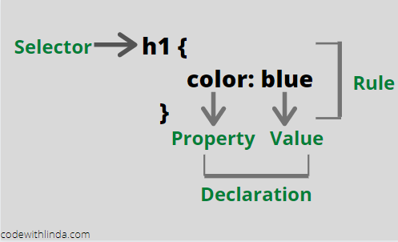

Have you ever been in a situation where the CSS styles you wrote and thought should be applied to a particular element wasn’t what you saw in the browser? That’s the ‘Cascading’ in Cascading Style Sheets (CSS) at work.
 
The CSS Cascade is the algorithm used by browsers to resolve the conflict of which style rule to apply to an element, when there are  2 or more style rules of the same property, but different values targeting the element. The style rules could be from the same style declaration and source or not.
 
<div class="inline-image"></div>

Understanding exactly how the cascade works, will help you as a developer to write CSS that won't give you headaches in the future.

See this example below:

``` css
/*Index.html*/
<div>
   <p>CSS is Awesome</p>
   <p>CSS Cascade is Awesomer !!</p>
</div>

/*index.css*/
div p {
    color: red;
}

p {
    color: blue;
}
```

Both color style declarations are “conflicting” as they are both targeting the same elements - the paragraphs, but with different color values. Which color do you think will be applied to the paragraphs then? 
 
This article is a little bit long, but after reading it, you’ll have a clearer understanding of how the cascade works, so much that you’ll be able to teach someone else coherently.

# Sources Of CSS

 
Before I get into how browsers select which conflicting css declaration to apply, you need to familiarize yourself with the different possible sources of css.
 
CSS could be supplied to browsers from 3 sources: 

1. Author: These are styles written by you; the developer and declared in the HTML either in the `<head>` with the `<link>` tag or inline.
2. User: These are styles enforced by the users of browsers usually for accessibility reasons. One example is when increasing the default font size unit of a browser. 
3. Browsers: These are default styles provided for elements by browsers. 

# Stages of the Cascade

To decide which conflicting declaration is of higher priority and should be applied, the css cascade goes through the following stages listed below, in ascending order.
 

1. Importance
2. Source/Origin
3. Selector Specificity
4. Order of Appearance/Position

 
Now, Let’s discuss each stage in detail.

## Importance

The first thing browsers do when they encounter conflicting declarations is the importance of each declaration i.e it checks if any of the declarations is declared with an !important, or is an animation rule with @keyframes. In this stage, the highest priority goes from :
 

1. Browser !important declarations.
2. User !important declarations.
3. Author ! important declarations
4. CSS animation declarations.

 
Take a look at the codepen example below:

<iframe height="300" style="width: 90%; margin: 3rem auto" scrolling="no" title="css-cascade:example 1" src="https://codepen.io/lindaflex/embed/JjGXYaK?height=265&theme-id=dark&default-tab=html,result" frameborder="no" allowtransparency="true" allowfullscreen="true">
  See the Pen <a href='https://codepen.io/lindaflex/pen/JjGXYaK'>css-cascade:example 1</a> by linda
  (<a href='https://codepen.io/lindaflex'>@lindaflex</a>) on <a href='https://codepen.io'>CodePen</a>.
</iframe>

The color declaration with `!important` is of higher priority than the one without so the button is given a background color of red. 
 
In summary, at the Importance stage, the conflicting declaration with the importance of higher priority is applied and the conflict is resolved. However, if neither of the conflicting declarations are declared with an `!important` , the cascade moves on to the second stage- Source/Origin; but if there are 2 declarations with `!important` from the same source, It moves to the third stage - Selector Specificity.

## Source/Origin

The next stage the cascade considers if none of the conflicting declarations have an `!important` , is the source of the styles. As discussed above, there are 3 possible sources of CSS styles and they are prioritised as so:
 

1. Author
2. User
3. Browser  

 
This stage is why, when you do not declare styling for elements, like `button` and `a` , the default styles provided for it by browsers are applied. It's why CSS resets <a target="blank" class="inline-link" href="https://cssreset.com/what-is-a-css-reset/">resets</a> are used.
 
Also, because CSS styles of author origins are of higher priority to those from user origins, developers are discouraged from specifying font sizes and dimensions in px, as it an absolute unit, and deprives users of the smooth flexibility of zooming in on pages and increasing default font sizes. This is anti accessibility. Here’s a <a target="blank" class="inline-link" href="https://www.24a11y.com/2019/pixels-vs-relative-units-in-css-why-its-still-a-big-deal/">great article</a> which explains this delima.
 
In summary, for the source/origin stage, the conflicting declaration with the source of the higher priority is applied and the conflict is resolved. If the conflicting declarations are from the same source- usually the author, the cascade goes on to the next stage: Selector specificity.

## Selector Specificity

When conflicting declarations are from the same source, browsers attempt to resolve the conflict according to which declaration is  within the selector(s) of the highest priority. 
 
CSS selectors types in order of highest priority to lowest priority are:
 

1. Inline styles
2. ID’s
3. Classes, pseudo-classes, attribute
4. Elements, pseudo-elements

 
Take a look at the codepen example below:
 
<iframe height="300" style="width: 90%; margin: 3rem auto" scrolling="no" title="css-cascade-example-2" src="https://codepen.io/lindaflex/embed/yLeOJyx?height=265&theme-id=dark&default-tab=html,result" frameborder="no" allowtransparency="true" allowfullscreen="true">
  See the Pen <a href='https://codepen.io/lindaflex/pen/yLeOJyx'>css-cascade-example-2</a> by linda
  (<a href='https://codepen.io/lindaflex'>@lindaflex</a>) on <a href='https://codepen.io'>CodePen</a>.
</iframe>

The button has a background color of red because inline styles are of higher priority to any type of selectors.
 
When none of the conflicting style declarations are inline styles, and a combination of different selector types are used for the style rule, browsers typically do some sort of arithmetic similar to elementary tens and hundreds addition to decide which selector group has the highest priority.

<div style="overflow-x:auto; ">
<table>
  <tr>
    <th> Id  </th>
    <th> classes/pseudo-classes/attributes </th>
    <th>  Elements/pseudo-elements </th>
   </tr>
  <tr>
    <td>0</td>
    <td>0</td>
    <td>0</td>
  </tr>
</table>
</div>

For each type of selector in rules with conflicting declarations, 1 is added to that selector type column. The conflicting declaration under the rule with the greatest number is given the highest priority and wins the conflict.
 
Let's take an example.
 
 
<iframe height="400" style="width: 90%; margin: 3rem auto" scrolling="no" title="Example" src="https://codepen.io/lindaflex/embed/MWKaaRe?height=265&theme-id=dark&default-tab=css,result" frameborder="no" allowtransparency="true" allowfullscreen="true">
  See the Pen <a href='https://codepen.io/lindaflex/pen/MWKaaRe'>Example</a> by linda
  (<a href='https://codepen.io/lindaflex'>@lindaflex</a>) on <a href='https://codepen.io'>CodePen</a>.
</iframe>

Applying what we discussed above:
 
<div style="overflow-x:auto;">
<table>
  <tr>
    <th> Selectors </th>
    <th> Id  </th>
    <th> classes/pseudo-classes/attributes </th>
    <th>  Elements/pseudo-elements </th>
    <th> Total </th>
  </tr>
  <tr>
    <td>.header-button</td>
    <td>0</td>
    <td>1</td>
    <td>0</td>
    <td>0 1 0</td>
  </tr>
   <tr>
    <td>header div#header-right .header-righ</td>
    <td>1</td>
    <td>1</td>
    <td>2</td>
    <td>1 1 2</td>
  </tr>
   <tr>
    <td>button.header-button</td>
    <td>0</td>
    <td>1</td>
    <td>1</td>
    <td>0 1 1</td>
  </tr>
</table>
</div>

The conflicting declaration inside the selector group with the highest number i.e `1 1 2` wins, the button takes a background color of red and the conflict resolves.
 
But, if the conflicting declarations have the same selector specificity weight i.e the total numbers are equal, the cascade moves on to the last stage - Order of Appearance.
 
## Order of Appearance
When conflicting declarations have the same selector specificity weight, the rule that comes in last wins the cascade battle.
 
Take a look at this example:

<iframe height="400" style="width: 90%; margin: 3rem auto" scrolling="no" title="Example" src="https://codepen.io/lindaflex/embed/JjGXKqb?height=265&theme-id=dark&default-tab=html,result" frameborder="no" allowtransparency="true" allowfullscreen="true">
  See the Pen <a href='https://codepen.io/lindaflex/pen/JjGXKqb'>Example</a> by linda
  (<a href='https://codepen.io/lindaflex'>@lindaflex</a>) on <a href='https://codepen.io'>CodePen</a>.
</iframe>

 
Here,both conflicting declarations have the same selector weight (`0 1 1`) but the button is red because the `background-color: red` declaration comes in last in the stylesheet.

This stage also applies for style links in the html `head`. If you link more than one stylesheet in your html `head`, and there are conflicting declarations from any of the stylesheets, declarations from the last linked stylesheet will be applied. This is why it is advisable to link your own custom styles after linking third party stylesheets e.g bootstrap or Material CSS.
 
Yippee! you’ve successfully  covered the CSS cascade in detail. Now,  go back to the question asked in the beginning. Can you answer it now?

# Some Key Takeaways & Best Practices
To write more maintainable CSS and avoid unintentional style bugs:
 
- Avoid using inline styles.
- Avoid using ID’s and combination selectors.
- Use classes only for styling  and id's for javascript interactions to avoid specificity errors.
- Put general element styling up top then specific styling with class names.
- Use !important only as a last resort.
- Rely on order when using third party stylesheets. Always link your author stylesheets last.
 
I truly hope this looooong article :) has somewhat helped you understand how the CSS Cascade works. Now, go on and  build something great.
 

