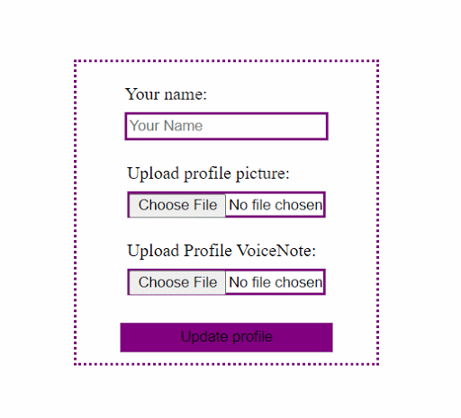

While surfing the web, I’m sure you’ve come across web applications with forms that allow users to upload files like a resume, a profile picture, or an EP on a music promotion site. The uploaded files may sometimes be displayed for preview, for the user to confirm their selection before submission.

After reading this article, you’ll understand how to set up a form to allow users to upload an image, audio or video using the `<input type=”file”>` and display it for preview using the Javascript `createObjectURL` API.

I’ll explain the process in steps so that even a beginner will have no problem grasping it.

Here’s a gif demo of what we’ll be building:





Now, Let’s get started.

## Step 1: Creating the Form.

```html
   <div class="form">
        <form>
            <label> Your name:<br />
                <input type='text' class="profile-name" placeholder="Your Name">
           </label>
            <label> Upload profile picture:<br />
               <input type='file' accept="image/*" class="profile-img"placeholder="">
            </label>
            <label>Upload Profile VoiceNote:<br />
               <input type='file' accept="audio/*" placeholder="" class="profile-aud">
            </label>
            <button type="submit">Update profile</button>
        </form>
   </div>

```

Here we’ve created a simple form with 3 inputs to accept users’ display name, profile picture and profile audio.

You may have noticed the `input type='file'`. Just like the other input types, the input type file lets the user choose one or more files from their local device storage for upload.

Also, you’ll see that there’s an accept attribute on both input file types. The ‘accept’ attribute describes to the file input which type of files to accept. It restricts users from uploading a wrong file type. So, the first file input will allow users to only upload image files of any type (png,jpeg, e.t.c) while the second file input will allow users to only upload audio files of any type.

## Step 2: Grab Value and Files From Inputs

Now let’s write some javascript to retrieve values and files from the respective inputs and then display them.

First, let’s define a function to get the files and name from the input.

```js
const getValuesFromInputs = () =>{
   const profileName = document.querySelector('input.profile-name').value;
   const profileImg = document.querySelector('input.profile-img').files[0];
   const profileAud = document.querySelector('input.profile-aud').files[0];

   document.querySelector('form').style.display = 'none';

   return [profileName, profileImg, profileAud];

}
```

The `getValuesFromInputs` function uses `document.querySelector` to select the respective inputs.

For the `profileName`, we’re using the input `value` property to grab the expected string value. For the `profileImg` and `profileAud` we’re using the files property to grab the expected files from the input. The HTML input’s files property returns a FileList object from the File API.

The FileList is an array-like object which returns a list of File objects attached to the element in question. Due to this, we’re able to get singular file objects using the index notation property of arrays. We use `[0]` to get the first and only  File object for each input since we are not accepting multiple entries.

## Step 3: Convert File Objects Into URL

To be able to display the uploaded image and audio, we’ll need to convert the respective file objects into URLs that can be assigned to the `src` attribute of the `img` or  `audio` tag.

Luckily, Javascript has a `URL.createObjectURL` method which takes in a Blob Object and returns a URL.

A Blob Object is a group of bytes that hold the data stored in a file. In other words, it is the representation of the file in bytes.

```js
const convertInputValues = () => {
  const [profileName, profileImg, profileAud] = getValuesFromInputs();

  const profileImgURL = URL.createObjectURL(profileImg);
  const profileAudURL = URL.createObjectURL(profileAud);

  return[profileAudURL, profileImgURL, profileName ]
}
```

The `convertInputValues` function uses array destructuring to get return values from the`getValuesFromInputs` function. `profileImg` and `profileAud` which are File Objects are then respectively passed to the `URL.createObjectURL` method. If you recall, I previously mentioned that the `URL.createObjectURL` accepts a blob as an argument. Well, the File Object is an instance of the Blob object, so It can be used on all instances that `Blob` can be used in.

Now, let’s grab these URL’s and display the image and audio.

## Step 4: Grab URL’s and supply them to DOM elements.

```js
const addInputToProfile = () => {

    const [profileAudURL, profileImgURL, profileName ]  = convertInputValues();

    document.querySelector('.profile h2').innerHTML = `${profileName}`;
    document.querySelector('.profile img').setAttribute('src', profileImgURL);
    document.querySelector('.aud').setAttribute('src', profileAudURL);

}

```

The `addInputToProfile` function uses document.querySelector to select elements in which we’ll be displaying the uploaded files and input.

These elements do not exist on the Html yet, so let’s go ahead and add them.

```html
    <header class="header">
        <div class="profile">
            
            <h2></h2>
        </div>
        <figure>
            <figcaption>Here's my Fab Intro:</figcaption>
            <audio class="aud"
                controls
                src=" ">
                    Your browser does not support the
                    <code>audio</code> element.
            </audio>
        </figure>
    </header>

```

Now, let’s add an event listener to the form’s submit button and bring our app to life.

## Step 5: Setup EventListener for Button

```js
document.querySelector('button').addEventListener('click', (e) => {
  e.preventDefault();
  addInputToProfile();
});
```

And, there you have it. The demo app is working just as expected. After selecting a profile image and audio, click on the submit button to preview your selections.

I’ve left the video upload implementation for you to try out as a challenge. Simply use the HTML5 `video` element and the same methods I used above.

You can find the code for the demo app in this <a target='blank' class="inline-link" href="https://github.com/Linda-Ikechukwu/Blog-Posts-Apps/tree/master/Upload-Files-JavaScript">github repo.</a>

## Some Final Notes

The URL generated by the createObjectURL method is volatile and is only valid within the window on which it is created. This means that once the page is reloaded the URL is released.

A common application of the concepts covered in this article, is to display a preview of an image, audio or video to the user before uploading to a server. If you'd like to see other common applications, check out this article : ‘On Blobs, Files and Data URI’s in JavaScript’.

If you have any questions, ask away in the comment section or find me on <a target='blank' class="inline-link" href="https://twitter.com/_MsLinda">twitter.</a>

Now, go build something great!


