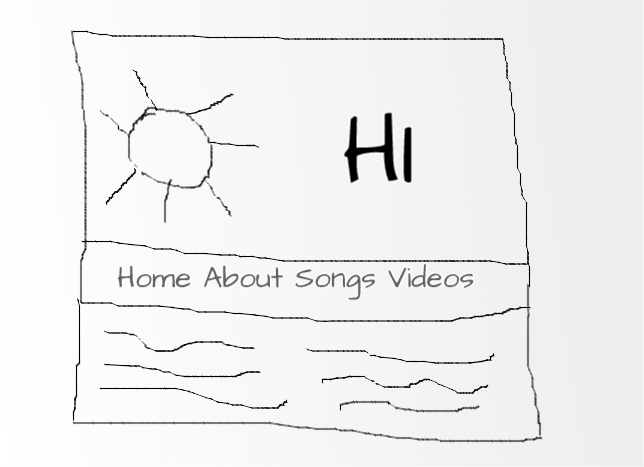

Over the weekend, I decided to take out some time to look at my website’s accessibility, performance and SEO stats and fix some of the issues.

I ran my website through the SiteImprove and lighthouse chrome extensions for web accessibility. In general, I found over 50 errors on SiteImprove and had a score of 85 on lighthouse.

What’s funny was that what it took for me to fix 80% of those accessibility issues was to make very minor changes to my HTML. After making the adjustments, my accessibility score jumped to 96. Not bad huh?

In this article, I’ll share 7 minor changes you can make to your HTML to make your website/web app more accessible.

Let’s get started.

## 1. Stop Using Divs Everywhere.

Really, stop it. Think about it, how would you feel if you walked into a grocery store and all sodas were put in the same type of bottle and labelled just ‘soda’. How would you be able to distinguish your favourite brand from another?

That’s exactly what you do to the browser when you use divs everywhere.

HTML 5 came with semantic elements, which you should use. Writing semantic HTML not only improves your site’s accessibility, but it also improves your SEO.

Divs should only be used within document landmarks or sections, to group related content. Use semantic HTML landmarks to help screen readers easily navigate your paeges. You can also go a step further by adding <a target='blank' href="https://developer.mozilla.org/en-US/docs/Web/Accessibility/ARIA/Roles" class="inline-link">WAI-ARIA roles </a>. to landmarks for more fullproof and maybe really old browsers.

```html
<body>
    <header>
        <nav role='navigation'>
            ---
        </nav>
    </header>
    <main role='main'>
        <aside>
            ---
        </aside>
        <section role='region'>
            <h1 role="heading"></h1>
            ----
        <section>
    </main>
</body>

```

Also, don't style a `p` or `span` as a header. There are `h1` to `h6` tags for that. Don't use `a` tags for buttons. Dont use div for navigations. There's `nav` for that. Don't use `div` for the footer. There's a `footer` tag for that too.

You can find a <a target='blank' href="https://www.freecodecamp.org/news/semantic-html5-elements/" class="inline-link">list of all semantic elements here </a>.

## 2. Placeholders are Great. Labels are Better!

As web designers/web developers, we have grown creative wings. Part of that creativity has some of us choosing not to add labels to inputs and styling the input’s placeholder to look like a label.

There’s nothing wrong with that until someone who uses screen readers has to access your site.
For every input, provide a label. Combine explicit and implicit labelling That is, wrap the input with the label tag and also associate them with the HTML `for` attribute.

```html

<label for='name'>Enter Your Name:
    <input name="name" id="name"></input>
</label>

```

But, if you do not want to include labels due to design-specs, add an aria-label to the input.

```html
<input name="name" id="name" aria-label=’name’></input>

```

## 3. Never Forget the Alt.

Having images without an alt attribute is a no-no for web accessibility. Always include descriptive alt texts for your images or leave the alt tag empty if the image is just for decoration, and adds no meaning to the content of the page (like a list marker).

Why? If no alt attribute is present on an image tag, screen readers will read the file name for the image instead, which can be a major distraction to those using screen reading technology.

Also tip for providing alt text is to resist the urge to include start alt descriptions with 'image of' or 'picture of'. This is because screen readers automatically announce an image as an image. So an image of `` would be read aloud by a screen reader as “image, image of an Linda”.

You can see that is repititive. A better alt text may be - `alt='Linda at a beach, laughing.'`.

## 4. Have a Skip Button

For every web page, the first thing you should provide is a skip link or button. This skip button is very useful for keyboard users and screen readers to be able to switch to the main content of the page without having to read through your header or navigation.

```html

 <a href='#main'>Skip To Main Content</a>
    <nav>....</nav>
    <main id="main"></main>
</body>

```

The skip button is usually visually hidden but not hidden to screenreaders. A CSS class like below can be used to achieve visual hiding only.

```css

.visually-hidden {
  clip: rect(0 0 0 0);
  clip-path: inset(50%);
  height: 1px;
  overflow: hidden;
  position: absolute;
  white-space: nowrap;
  width: 1px;
}

```

## 5. Do not visually arrange elements with HTML

Your Html elements should always be arranged in the proper logical manner, no matter how you want them to appear visually. Take the web layout below as an example.



According to the design, the navigation should be below the header. It would be wrong to write the HTML this way:

```html

<body>
   <header>...header image and text<header>
   <nav>.....</nav>
</body>

```

In accessibility standards, in addition to the skip link, the primary navigation should come above other elements in the page for easier navigation. A better approach is to properly write the HTML in the correct logical order, then re-arrange it visually using the `order` property for flex and grid containers or CSS positioning.

```html

<body>
    <nav>.....</nav>
   <header>...header image and text<header>
</body>

```

## 6. Table Headers, not Table Data

Yeah, this still happens. I’ve come across sites where the table headers were put in <td> tags instead of <th> tags and then styled to be bold. This greatly affects screen readers that will not be able to interpret that it is a header not a data like everything else.

Another thing is to remember to add captions. With table captions, screen readers can provide more context to help visually impaired users understand what a table is all about.

```html
<table>
    <caption>Weekly Earnings For January</caption>
    <thead>
        <tr>
           <th>Week 1</th>
           <th>Week 2</th>
        </tr>
    </thead>
    <tbody>
        <tr>
            <td>N 30</td>
            <td>N 40</td>
        </tr>
    </tbody>
</table>

```

## 7. Use Aria-Label for links with no inner text

There are times when link tags are used to wrap another HTML element, so there can’t be text between the tags. For example, using an image as a link or using a social icon as a link. In these cases, add an aria-label to the link tag describing its purpose.

```html

<a href='#main' aria-label="Checkout my pink's cat website">
   </img>
</a>

```

## Conclusion

In this article, I've covered some common mistakes made when writing HTML that contributes to making sites inaccessible. This is by no means and exhaustive guide, but it is a starting point. I hope we all take note of them, make necessary changes and strive to build more accessible products. Accessibility should never be an afterthought.

If you liked this article, or have any questions or feedback, you can leave a comment below or say hi to me on <a target='blank' class='inline-link' href='https://twitter.com/_MsLinda'> twitter.</a>

Now, go and build something great!


